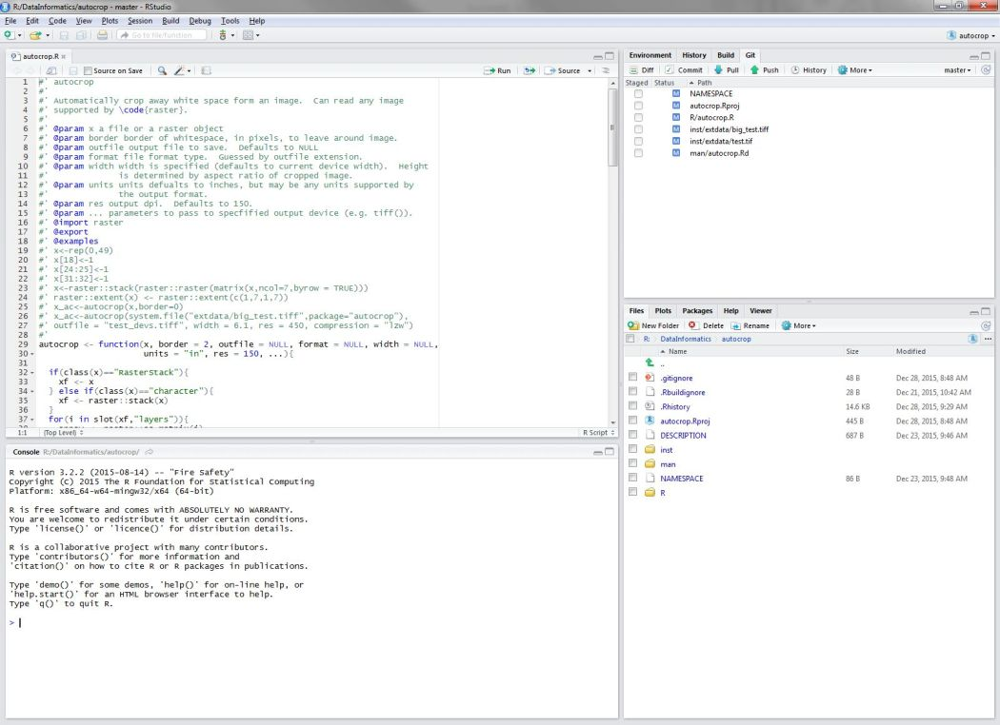
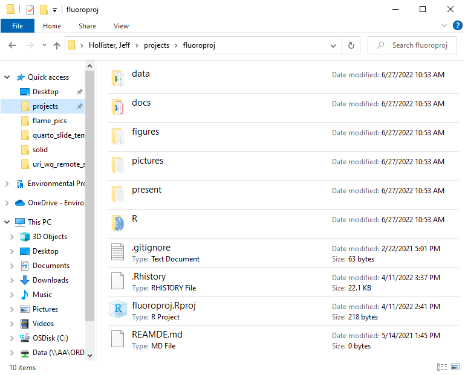
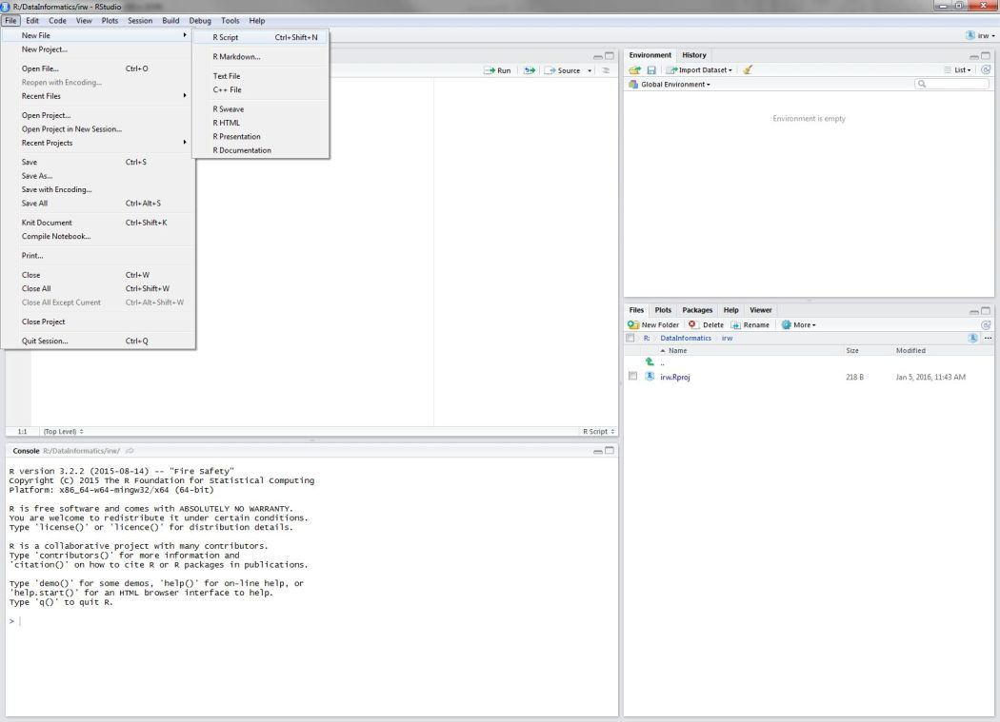

# RStudio

In this first lesson we are going to go over the very basics of using RStudio. We need to do this so we can jump into our example.

## Lesson Outline:

-   [Working with RStudio](#working-with-rstudio)

## Lesson Exercises:

-   [Exercise 1.1](#exercise-11)

## Working with RStudio {#working-with-rstudio}

Over the last several years, RStudio has become a very popular IDE (integrated development environment) for R. In addition to interacting with the R Console, RStudio has many extras built in including version control integration, package building, reproducible research, de-bugging, and built-in text editor with smart highlighting and code completion. This is the environment we will be using for the workshop and should set you up for continued learning with R. RStudio is also an EPA pre-approved IDE for use with R. In theory, it should be a very stratightfoward installation.

Before we get to the first exercise, let's spend a bit of time working with RStudio. You can follow along on your own machines as we try different things with RStudio.

### Fire up RStudio (and R)

Find the RStudio shortcut or menu (OS specific of course) and fire it up. Once done, it should look something like:

Let's take some time to look around. I'll show each of the different sections, or "panes" as they are known.

### Projects

Projects are a way to organize your work in RStudio. Essentially they are folders, but with a few added files so that you can manage some options on a per project basis.

To create a new project use <File:New> Project, or use the drop-down on the top right of the RStudio window. It will look like this after you select "New Project..."

####  

#### Why use projects?  The short version.

I HIGHLY (VERY HIGHLY!!) recommend (demand?!) using projects as they take care of a lot of things for you, force you to use some semblance of organization in your R (and other) work, and generally make it easier to work with your data in R. It is what we will be using in this workshop and they are what I have used for years to manage all of my work.  I currently have 350+ projects.  Many small and frivolous, many are much larger and comprehensive.  

There a many reasons why I am a big fan of using projects, but the biggest are:

-   Easy file paths: Do you immediately know what "C:\\Users\\JHollist\\projects" or "\~/projects/acesd_intro_r" mean to your computer and/or do you really like typing all that out every time you need to find a file? Well projects help alleviate the need to fully define file paths.
-   Re-usable and reproducbile structure: Somewhat related to the first reason, projects allow you to more easily reuse a folder and file structure from project to project. An example:\
    

-   Easy to add version control: A project is a folder and a git repository is a folder with git stuff added. Easy to add. Not implying the git itself is easy to use!
-   EPA QAPP friendly: An RStudio Project can serve the role of a research study file and could easily be associated with a RAPID research project and/or a STICS product. Some variation expected!

In short, if you find yourself struggling with file organization, if you want to share your work with others, if you want some help managing file paths, or if you want to create cleaner and more reproducible code, then use projects!

### Source

The source you work on will often be in R scripts (i.e., text files that hold the code you write), but could also include R Markdown files (`.Rmd`), HTML files, or other programming language scripts (e.g. javascript). In this workshop, we will work with R Scripts (e.g `.R` files) and the console during this workshop. To create a new R script you can use "<File:New> <File:R> Script", to save an R script you can use the "floppy disk" icon, or save from the drop down, and to open an existing R script, you can use "<File:Open> File" also from the drop down menu.

### Interacting with R inside of RStudio

Once you have code in your R Script or have an opened an R Script, that code still needs to be sent to the R console and interpreted by R. There are several ways to do this. There is the old stand-by of copying and pasting, but this is a bit cumbersome. Instead you can use the `Run` menu in the upper right corner of the source pane, or even better (I think so, anyway) you can use `ctrl-enter`. Both the `Run` buttons and `ctrl-enter` will send the line that your cursor is on and move to the next line or it will send just the selected text.

## Exercise 1.1

Now that we have RStudio opened and know are way around a bit, we are going to jump straight to the end and see what a complete R script looks like, run the code and be amazed! This is kind of like telling a joke by starting with the punch line first!

1.  Follow the link to [The Punch Line](punchline.md) and we will work through that together to get more familiar with R Studio, R Scripts, and R.

## Homework

To practice what we have seen today we will be opening and running code inside of a new script. The script is available on the class repository at [homework/homework_01.R](https://raw.githubusercontent.com/jhollist/acesd_intro_r/master/homework/homework_01.R)

1.  Open RStudio
2.  Create a new RStudio project and call it "homework_1".
3.  Save the R Script from [homework/homework_01.R](https://raw.githubusercontent.com/jhollist/acesd_intro_r/master/homework/homework_01.R) to the project you just created.
4.  Open the R Script.
5.  Run it.
6.  Be prepared to answer: What did the script do?

If you have any questions or problems with the assignment, Jeff is available via Teams and/or email for help.
