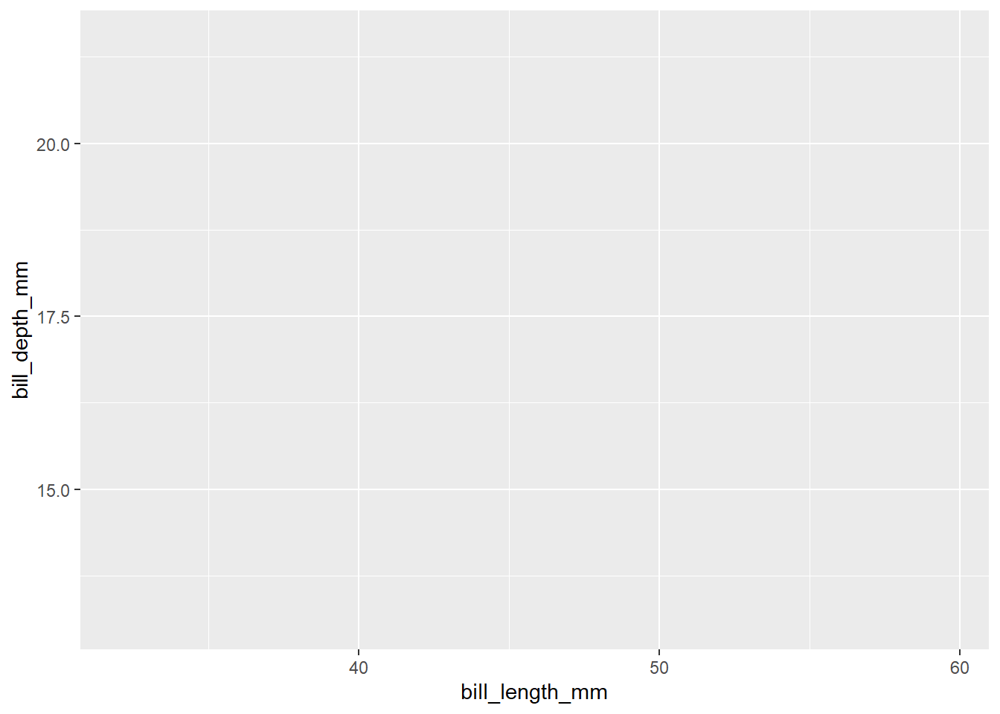
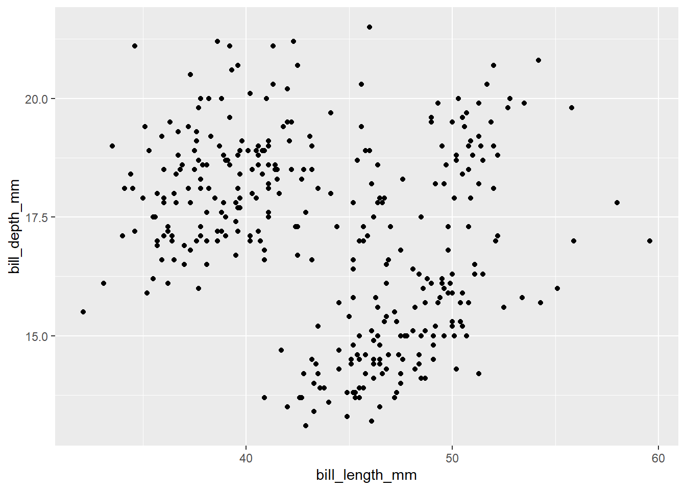
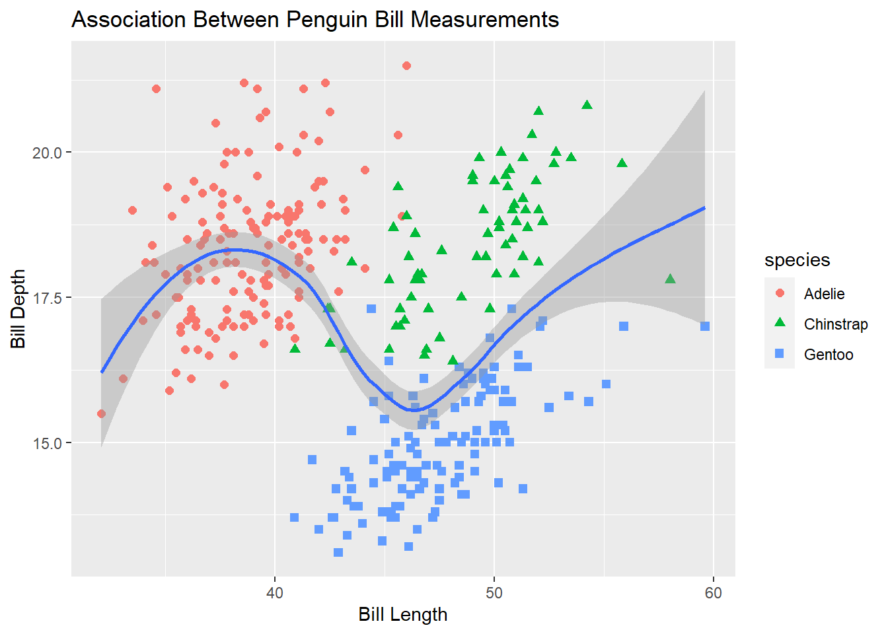
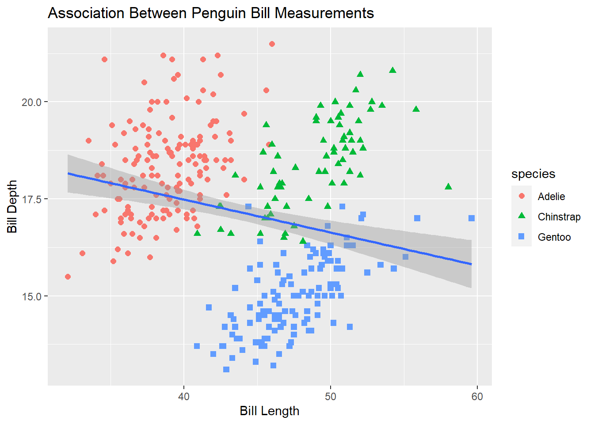
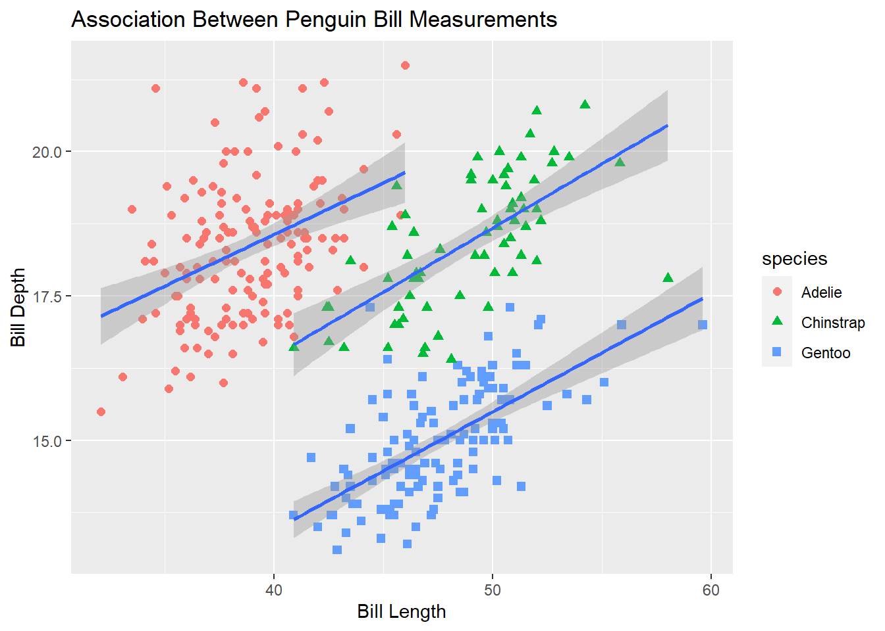
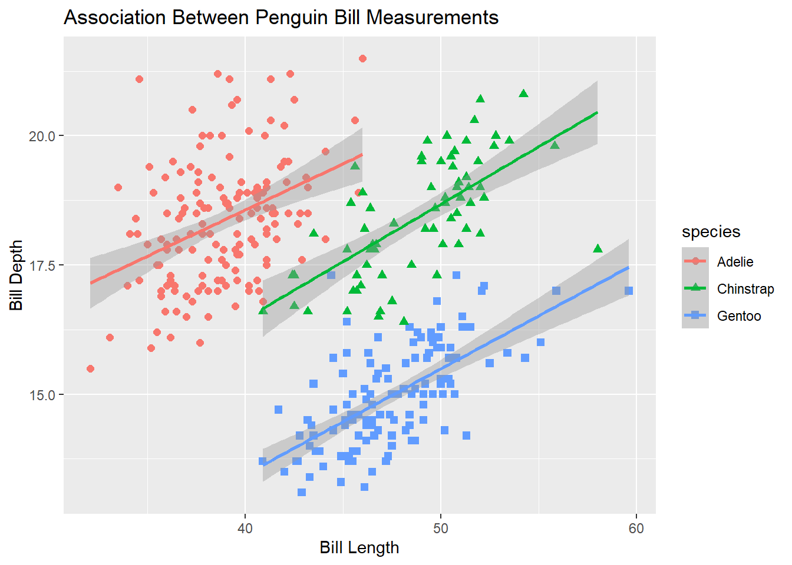
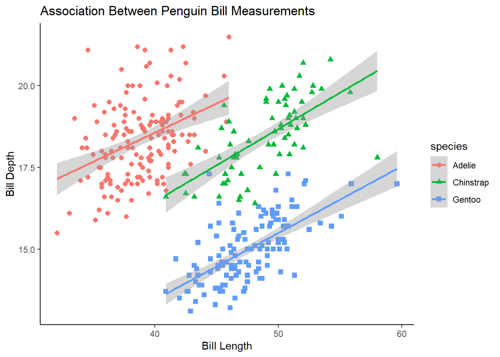
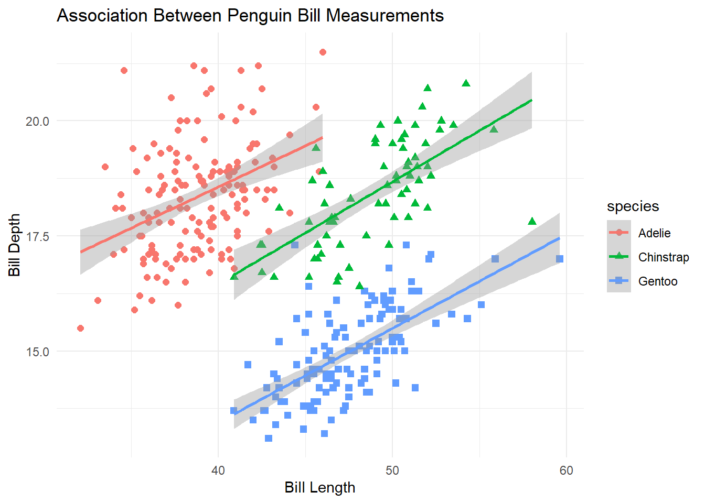

# Data Visualization with ggplot2

Visualizing data is an area where R really shines.  There are many ways to plot data with R and these include base R, `lattice`,`grid` and , `ggplot2`.  The only one we will work with is `ggplot2`, which is now (I have no data to back this up), the de-facto standard for visualizing data in R.  Given that `ggplot2` is general package for creating essentially ALL types of visualizations, it can seem quite complex (and it is).  What I hope you will get out of this section is a basic understanding of how to create a figure and, most importantly, how to find help and examples that you can build off of for your own visualizations.  If you want to read more about why some people choose base plotting vs `ggplot2`, the twitter/blogosphere "argument" between [Jeff Leek](https://simplystatistics.org/2016/02/11/why-i-dont-use-ggplot2/) and [David Robinson](http://varianceexplained.org/r/why-I-use-ggplot2/) is worth some time.

## Lesson Outline
- [Examples](#examples)
- [Basics of `ggplot2`](#basics-of-ggplot2)
- [Example explained](#example-explained)

## Exercise
- [Homework 4.1](#homework-41)

## Examples
Before we get started, I do like to show what is possible.

A few examples of maps built with R show this:


Another examples from work I did with Kenny Raposa.


from: Raposa et al. (2018). Top-down and bottom-up controls on overabundant New England salt marsh crab populations. PeerJ. https://doi.org/10.7717/peerj.4876


from: Kuhn et al. (2018) Performance of national maps of watershed integrity at watershed scales. Water. https://doi.org/10.3390/w10050604

And some cool examples using `ggplot2` with `plotly`.

<http://blog.revolutionanalytics.com/2014/11/3-d-plots-with-plotly.html>

Lastly, so that you know that there are many (often cool) mistakes that lead up to a final visualization there is [Accidental aRt](http://accidental-art.tumblr.com/).  And for a specific example ...

And the map I showed earlier of the trophic state probability had as one of its early iterations this ["psychadelic doughnut"](http://accidental-art.tumblr.com/post/96720455195/was-trying-to-mess-with-projections-in-ggplot)


(**ht to Anne Kuhn, my office mate, for the name**)

A few other great links that I have recently found are also useful for inspiration.  First, is a repository on GitHub that has most (all?) of the currently available color palletes in R: <https://github.com/EmilHvitfeldt/r-color-palettes>.  Second, the [R graph gallery](https://www.r-graph-gallery.com/) is a fantastic resource for seeing all that is possible for visualization in R and the code on how to do it!!

Now that we are sufficiently motivated, lets take a step back to the very basics.

## Introduction to `ggplot2`: scatterplot
When you first get a dataset and are just starting to explore it, you want do be able to quickly visualize different bits and pieces about the data.  I tend to do this, initially, with base R. But since our time is short, we are going to focus our efforts just on `ggplot2`.

A lot has been written and discussed about `ggplot2`.  In particular see [here](http://ggplot2.org/), [here](http://docs.ggplot2.org/current/) and [here](https://github.com/karthikram/ggplot-lecture).  The gist of all this, is that `ggplot2` is an implementation of something known as the "grammar of graphics."  This separates the basic components of a graphic into distinct parts (e.g. like the parts of speech in a sentence).  You add these parts together and get a figure.

Before we start developing some graphics, we need to do a bit of package maintenance.  If `ggplot2` had not be installed (it should be by now), install it and make sure to load up the package with `library()`


```r
install.packages("ggplot2")
library("ggplot2")
```

With that finished, we can now use `ggplot2`.  First thing we need to do is to create our ggplot object.  Everything will build off of this object.  The bare minimum for this is the data (handily, `ggplot()` is expecting a data frame) and `aes()`, or the aesthetics layers.  Oddly (at least to me), this is the main place you specify your x and y data values.


```r
# aes() are the "aesthetics" mappings.  When you simply add the x and y
# that can seem a bit of a confusing term.  You also use aes() to 
# change color, shape, size etc. of some items 
ggplot(penguins, aes(bill_length_mm, bill_depth_mm))
```



Great, nothing plotted...  All we did at this point is create an object that contains our data and what we want on the x and y axes.  We haven't said anything about what type of plot we want to make.  That comes next with the use of geometries or `geom_`'s.  

So if we want to simply plot points we can add that geometry to the ggplot object.

A side note on syntax.  You will notice that we add new "things" to a ggplot object by adding new functions.  In concept this is somewhat similar to the piping we talked about earlier.  Essentially it takes the output from the first function as the input to the second.  So to add points and create the plot, we would do:


```r
#Different syntax than you are used to
ggplot(penguins, aes(bill_length_mm, bill_depth_mm)) +
  geom_point()
```



It is usually preferable to save this to an object.


```r
#This too can be saved to an object
penguin_gg <- ggplot(penguins, aes(bill_length_mm, bill_depth_mm)) +
  geom_point()

#Call it to show the plot
penguin_gg
```


Not appreciably better than base, in my opinion.  But what if we want to add some stuff...

First a title and some axis labels.  These are part of `labs()`.


```r
#Getting fancy to show italics and greek symbols
penguin_gg <- ggplot(penguins, aes(bill_length_mm, bill_depth_mm)) +
  geom_point() +
  labs(title="Association Between Penguin Bill Measurements",
                     x="Bill Length", y="Bill Depth")
penguin_gg
```


Now to add some colors, shapes etc to the point.  Look at the `geom_point()` documentation for this.


```r
penguin_gg <- ggplot(penguins, aes(bill_length_mm, bill_depth_mm)) +
  geom_point(aes(color=species, shape=species),size=2) +
  labs(title="Association Between Penguin Bill Measurements",
                     x="Bill Length", y="Bill Depth")
penguin_gg
```


You'll notice we used `aes()` again, but this time inside of the geometry.  This tells ggplot2 that this aes only applies to the points.  Other geometries will not be affected by this.

In short, this is much easier than using base.  Now `ggplot2` really shines when you want to add stats (regression lines, intervals, etc.). 

Lets add a loess (LOcal RegrESSion) line with 95% confidence intervals.


```r
penguin_scatter_loess <- ggplot(penguins, aes(bill_length_mm, bill_depth_mm)) +
  geom_point(aes(color=species, shape=species),size=2) +
  labs(title="Association Between Penguin Bill Measurements",
                     x="Bill Length", y="Bill Depth") +
  geom_smooth(method = "loess")
penguin_scatter_loess
```



Try that in `base` with so little code!  But that doesn't look quite right, so let's try to add a linear regression line with:


```r
penguin_scatter_lm <- ggplot(penguins, aes(bill_length_mm, bill_depth_mm)) +
  geom_point(aes(color=species, shape=species),size=2) +
  labs(title="Association Between Penguin Bill Measurements",
                     x="Bill Length", y="Bill Depth") +
  geom_smooth(method="lm")
penguin_scatter_lm
```



And that's interesting...  Maybe we shouldn't pool these all together (read up on [Simpson's Paradox](https://en.wikipedia.org/wiki/Simpson%27s_paradox)). 


```r
penguin_scatter_lm_group <- ggplot(penguins, aes(bill_length_mm, bill_depth_mm)) +
  geom_point(aes(color=species, shape=species),size=2) +
  labs(title="Association Between Penguin Bill Measurements",
                     x="Bill Length", y="Bill Depth") +
  geom_smooth(method="lm", aes(group=species))
penguin_scatter_lm_group
```



And, if we wanted our regression lines to match the color.


```r
penguin_scatter_lm_color <- ggplot(penguins, aes(bill_length_mm, bill_depth_mm)) +
  geom_point(aes(color=species, shape=species),size=2) +
  labs(title="Association Between Penguin Bill Measurements",
                     x="Bill Length", y="Bill Depth") +
  geom_smooth(method="lm", aes(color=species))
penguin_scatter_lm_color
```



Notice, that we specified the `aes()` again, but for `geom_smooth()`.  We only specified the x and y in the original `ggplot` object, so if want to do something different in the subsequent functions we need to overwrite it for the function in which we want a different mapping (i.e. groups).

Now, I don't particular love the default look and feel (e.g. background, plot boundaries, fonts, ...) of these plots.  We can control all of the with the use of `theme()`.  Digging into the details on that is a bit beyond what we want to do now.  That being said there are some other canned themes we can use


```r
# Black and white
penguin_scatter_lm_color + theme_bw()
```


```r
# Classic
penguin_scatter_lm_color + theme_classic()
```



```r
# Minimal
penguin_scatter_lm_color + theme_minimal()
```



And if you want a whole lot more canned themes to play with, install and load the `ggthemes` package.  And I'll put in a plug here for the `hrbrthemes` from Bob Rudis.  My go to is his `theme_ipsum_rc()`.

The above material is A LOT!!  In short, we've seen that some of the initial setup for ggplot is a bit more verbose than base R, but when we want to do some more complex plots it is much easier in `ggplot2`.  

Lastly, we have only looked at one geometry, but there are tons.  Lets look at some of those.  The best place to do this is excellent `ggplot2` documentation of the [geom functions](http://docs.ggplot2.org/current/).

## Punchline Example Explained
Now that we have the basics of `ggplot2` down, let's take a closer look at our example in `acesd_analysis.R`.

## Homework 4.1
For this homework we will work on creating a new plot from scratch.  Add some new code at the end of our `acesd_anlaysis.R` that does the following

1. Data visualization is as much data manipulation as it is figuring how to create a plot.  We have already taken care of that with our prior homework.  Lets use the `nla_wq_sites` data frame to create a new plot. 
2. Let's create a scatterplot with total nitrogen (`ntl`) on the x-axis, total phosphorus (`ptl`) on the y-axis, and color the points based on the `state`.
3. Set the size of all points to 5.
4. Use a theme other than the default.
5. And label your axes with good labels and add a meaningful title.
6. Try to use `ggplotly` from the `plotly` package to create an interactive version of this plot.
7. Don't forget to comment your code.

As always, I am available to help if needed, just send me an email!

