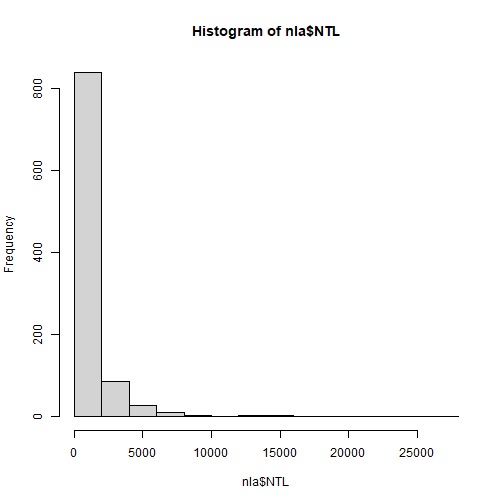
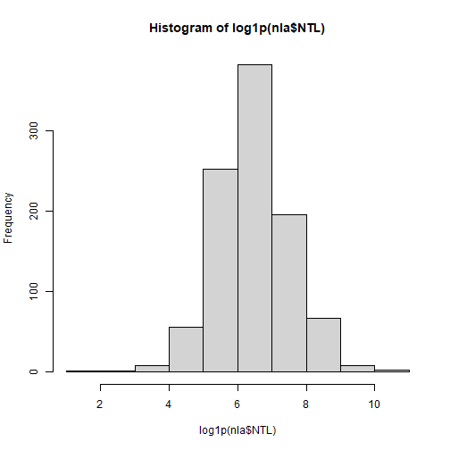
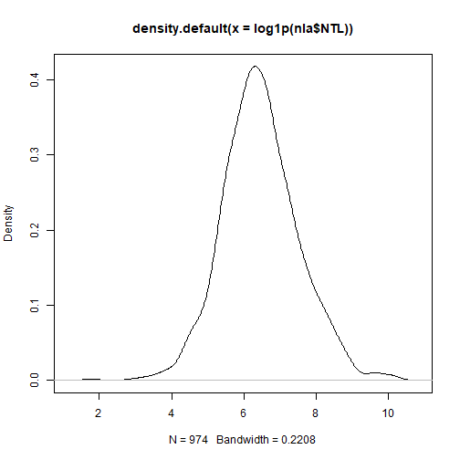
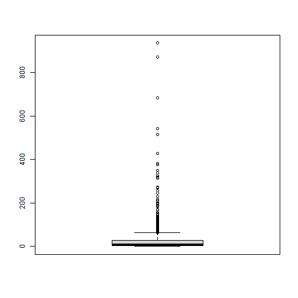
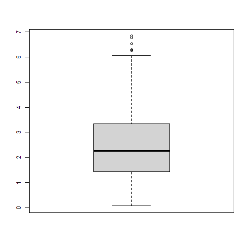
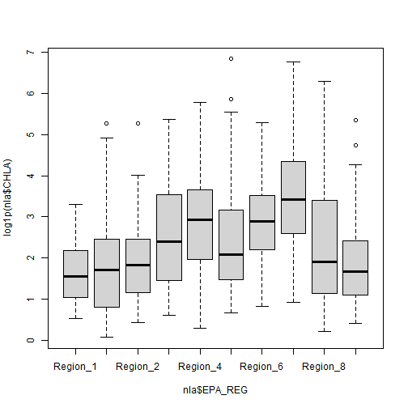
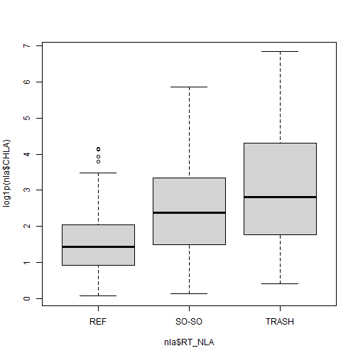

# Introduction
This lesson will cover calculating basic statistics with R, conducting statistical tests, and building simple linear models.  We will use the NE NERRS data for the examples.

## Get Data
First step in any project will be getting the data read into R.  For this lesson we are using the NE NERRS data that we have been using all along, which ,luckily, we already have locally.  From our `nerrs_analysis.R` script we can re-run a bunch of that code.  I've copied over the important bits here.  Alternatively, you can just open up your `nerrs_analysis.R` and run everything in there.  


```r
library(dplyr)
library(readr)
library(tidyr)

ne_nerrs_wq <- read_csv("ne_nerrs_wq_2020.csv", guess_max = 600000) %>%
  select(site, datetimestamp:f_do_pct, ph:f_turb) %>%
  mutate(f_temp = case_when(.data$f_temp != 0 ~
                              NA_real_,
                            TRUE ~ .data$f_temp),
         f_spcond = case_when(.data$f_spcond != 0 ~
                                NA_real_,
                              TRUE ~ .data$f_spcond),
         f_sal = case_when(.data$f_sal != 0 ~
                             NA_real_,
                           TRUE ~ .data$f_sal),
         f_do_pct = case_when(.data$f_do_pct != 0 ~
                                NA_real_,
                              TRUE ~ .data$f_do_pct),
         f_ph = case_when(.data$f_ph != 0 ~
                            NA_real_,
                          TRUE ~ .data$f_ph),
         f_turb = case_when(.data$f_turb != 0 ~
                              NA_real_,
                            TRUE ~ .data$f_turb)) %>%
  filter(complete.cases(.)) %>%
  select(site, datetimestamp, temp, sal, do_pct, ph, turb) %>%
  mutate(reserve = str_sub(site, 1, 3),
         datetime = ymd_hms(datetimestamp),
         year = year(datetime),
         month = month(datetime),
         day = day(datetime),
         date = ymd(paste(year, month, day, "-"))) %>%
  select(reserve, date, temp, sal, do_pct, ph, turb) %>%
  pivot_longer(cols = temp:turb, names_to = "param",  values_to = "measurement") %>%
  group_by(reserve, date, param) %>%
  summarize(measurement = mean(measurement, na.rm = TRUE)) %>%
  ungroup() %>%
  pivot_wider(id_cols = reserve:date, names_from = param, values_from = measurement)
```


So now we have our dataset ready for analysis.

## Analyze Data

### Basic Stats
First step in analyzing a dataset like this is going to be to dig through some basic statistics as well as some basic plots.  

We can get a summary of the full data frame:


```r
#Get a summary of the data frame
summary(ne_nerrs_wq)
```

```
##    reserve               date                do_pct             ph             sal              temp       
##  Length:659         Min.   :2020-05-01   Min.   : 52.84   Min.   :6.651   Min.   : 8.034   Min.   : 7.487  
##  Class :character   1st Qu.:2020-06-12   1st Qu.: 84.26   1st Qu.:7.606   1st Qu.:23.552   1st Qu.:16.798  
##  Mode  :character   Median :2020-07-23   Median : 89.17   Median :7.743   Median :28.878   Median :19.822  
##                     Mean   :2020-07-23   Mean   : 90.01   Mean   :7.693   Mean   :26.146   Mean   :19.529  
##                     3rd Qu.:2020-09-02   3rd Qu.: 95.65   3rd Qu.:7.838   3rd Qu.:30.169   3rd Qu.:22.787  
##                     Max.   :2020-10-15   Max.   :124.51   Max.   :8.093   Max.   :32.019   Max.   :27.744  
##       turb        
##  Min.   : 0.9583  
##  1st Qu.: 2.4941  
##  Median : 3.7361  
##  Mean   : 5.5278  
##  3rd Qu.: 6.7969  
##  Max.   :55.0260
```

Or, we can pick and choose what stats we want.  For instance:


```r
#Stats for Total Nitrogen
mean(ne_nerrs_wq$turb)
```

```
## [1] 5.527813
```

```r
median(ne_nerrs_wq$turb)
```

```
## [1] 3.736111
```

```r
min(ne_nerrs_wq$turb)
```

```
## [1] 0.9583333
```

```r
max(ne_nerrs_wq$turb)
```

```
## [1] 55.02604
```

```r
sd(ne_nerrs_wq$turb)
```

```
## [1] 5.448075
```

```r
IQR(ne_nerrs_wq$turb)
```

```
## [1] 4.302753
```

```r
range(ne_nerrs_wq$turb)
```

```
## [1]  0.9583333 55.0260417
```

### Some quick useful viz

While visualization isn't the point of this lesson, some things are useful to do at this stage of analysis.  In particular is looking at distributions and some basic scatterplots.

We can look at histograms and density:


```r
#A single histogram using base
hist(ne_nerrs_wq$turb)
```



```r
#Log transform it
hist(log1p(ne_nerrs_wq$turb)) #log1p adds one to deal with zeros
```



```r
#Density plot
plot(density(log1p(ne_nerrs_wq$turb)))
```




And boxplots:


```r
#Simple boxplots
boxplot(ne_nerrs_wq$turb)
```



```r
boxplot(log1p(ne_nerrs_wq$turb))
```



```r
#Boxplots per group
boxplot(log1p(ne_nerrs_wq$turb)~ne_nerrs_wq$reserve)
```



And scatterplots:


```r
#A single scatterplot
plot(log1p(nla$date),log1p(ne_nerrs_wq$turb))
```

```
## Error in plot(log1p(nla$date), log1p(ne_nerrs_wq$turb)): object 'nla' not found
```

And we can do a matrix of scatterplots from a data frame, but we should be careful as non-numeric columns won't log transform and many columns will make for a very uninformative matrix!  So lets subset our dataframe and plot that.


```r
# Subset with dplyr::select
nerrs_numeric_columns <- ne_nerrs_wq %>%
  select(do_pct, ph, sal, temp, turb)

#A matrix of scatterplot
plot(log1p(nerrs_numeric_columns))
```


## Some tests: t-test and ANOVA
There are way more tests than we can show examples for.  For today we will show two very common and straightforward tests.  The t-test and an ANOVA.

### t-test
First we will look at the t-test to test and see if there is a difference in `turb` in the first half of the sampling period vs the later half.  This is a two-tailed test. There are two approaches for this 1) using the formula notation if your dataset is in a "long" format or 2) using two separate vectors if your dataset is in a "wide" format.  We will show this with the formula notation.

First, we need to figure out first half and last half (this also gets us to start thinking about time series analyses):


```r
median_date <- median(ne_nerrs_wq$date)
ne_nerrs_wq <- ne_nerrs_wq %>%
  mutate(halves = case_when(date <= median_date ~
                              "FirstHalf",
                            date > median_date ~
                              "LastHalf",
                            TRUE ~ NA_character_))
```


```r
#Long Format
t.test(ne_nerrs_wq$turb ~ ne_nerrs_wq$halves)
```

```
## 
## 	Welch Two Sample t-test
## 
## data:  ne_nerrs_wq$turb by ne_nerrs_wq$halves
## t = 0.67041, df = 629.06, p-value = 0.5028
## alternative hypothesis: true difference in means between group FirstHalf and group LastHalf is not equal to 0
## 95 percent confidence interval:
##  -0.5490126  1.1181816
## sample estimates:
## mean in group FirstHalf  mean in group LastHalf 
##                5.669889                5.385305
```

Take a look at the help (e.g. `?t.test`) for more details on other types of t-tests (e.g. paired, one-tailed, etc.)

### ANOVA
ANOVA can get involved quickly and I haven't done them since my last stats class, so I'm not the best to talk about these, but the very basics require fitting a model and wrapping that in the `aov` function.  In the [Getting More Help section](#getting-more-help) I provide a link that would be a good first start for you ANOVA junkies.  For today's lesson though, lets look at the simple case of a one-way analysis of variance and check if reserves show a difference in our turbidity.


```r
# A quick visual of this:
boxplot(log1p(ne_nerrs_wq$turb)~ne_nerrs_wq$reserve)
```



```r
# One way analysis of variance
nerrs_anova <- aov(log1p(turb)~reserve, data=ne_nerrs_wq)
nerrs_anova #Terms
```

```
## Call:
##    aov(formula = log1p(turb) ~ reserve, data = ne_nerrs_wq)
## 
## Terms:
##                  reserve Residuals
## Sum of Squares  114.7120  123.1076
## Deg. of Freedom        3       655
## 
## Residual standard error: 0.4335327
## Estimated effects may be unbalanced
```

```r
summary(nerrs_anova) #The table
```

```
##              Df Sum Sq Mean Sq F value Pr(>F)    
## reserve       3  114.7   38.24   203.4 <2e-16 ***
## Residuals   655  123.1    0.19                   
## ---
## Signif. codes:  0 '***' 0.001 '**' 0.01 '*' 0.05 '.' 0.1 ' ' 1
```

```r
anova(nerrs_anova) #The table with a bit more
```

```
## Analysis of Variance Table
## 
## Response: log1p(turb)
##            Df Sum Sq Mean Sq F value    Pr(>F)    
## reserve     3 114.71  38.237  203.44 < 2.2e-16 ***
## Residuals 655 123.11   0.188                      
## ---
## Signif. codes:  0 '***' 0.001 '**' 0.01 '*' 0.05 '.' 0.1 ' ' 1
```


## Correlations and Linear modeling
The last bit of basic stats we will cover is going to be linear relationships.

### Correlations
Let's first take a look at correlations.  These can be done with `cor()`.


```r
#For a pair
cor(log1p(ne_nerrs_wq$ptl),log1p(ne_nerrs_wq$ntl))
```

```
## Error in log1p(ne_nerrs_wq$ntl): non-numeric argument to mathematical function
```

```r
#For a correlation matrix
cor(log1p(nla_numeric_columns))
```

```
## Error in is.data.frame(x): object 'nla_numeric_columns' not found
```

```r
#Spearman Rank Correlations
cor(log1p(nla_numeric_columns),method = "spearman")
```

```
## Error in is.data.frame(x): object 'nla_numeric_columns' not found
```

You can also test for differences using:


```r
cor.test(log1p(nla$ptl),log1p(nla$ntl))
```

```
## Error in cor.test(log1p(nla$ptl), log1p(nla$ntl)): object 'nla' not found
```

### Linear models
Basic linear models in R can be built with the `lm()` function.  If you aren't building standard least squares regressin models, (e.g. logistic) or aren't doing linear models then you will need to look elsewhere (e.g `glm()`, or `nls()`).  For today our focus is going to be on simple linear models.  Let's look at our ability to model chlorophyll, given the other variables we have.


```r
# The simplest case
chla_tp <- lm(log1p(chla) ~ log1p(ptl), data=nla) #Creates the model
```

```
## Error in is.data.frame(data): object 'nla' not found
```

```r
summary(chla_tp) #Basic Summary
```

```
## Error in summary(chla_tp): object 'chla_tp' not found
```

```r
names(chla_tp) #The bits
```

```
## Error in eval(expr, envir, enclos): object 'chla_tp' not found
```

```r
chla_tp$coefficients #My preference
```

```
## Error in eval(expr, envir, enclos): object 'chla_tp' not found
```

```r
coef(chla_tp) #Same thing, but from a function
```

```
## Error in coef(chla_tp): object 'chla_tp' not found
```

```r
resid(chla_tp) # The residuals
```

```
## Error in resid(chla_tp): object 'chla_tp' not found
```

We can also do multiple linear regression.


```r
chla_tp_tn_turb <- lm(log1p(chla) ~ log1p(ptl) + log1p(ntl) + log1p(turb), data = nla)
```

```
## Error in is.data.frame(data): object 'nla' not found
```

```r
summary(chla_tp_tn_turb)
```

```
## Error in summary(chla_tp_tn_turb): object 'chla_tp_tn_turb' not found
```

There's a lot more we can do with linear models including dummy variables (character or factors will work), interactions, etc.  That's a bit more than we want to get into.  Again the link below is a good place to start for more info.

## Getting More Help
One nice site that covers basic stats in R is [Quick R: Basic Statistics](http://www.statmethods.net/stats/index.html).  There are others, but that is a good first stop.
