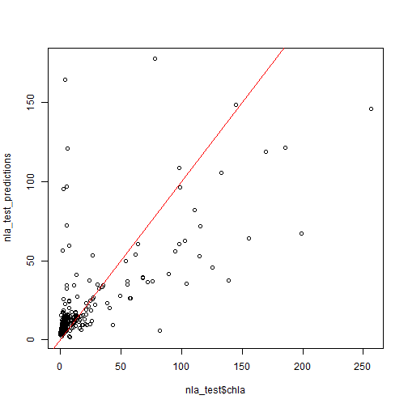
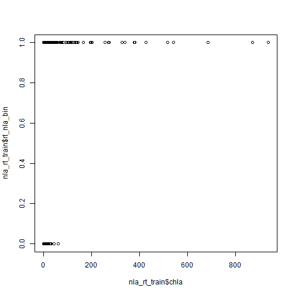
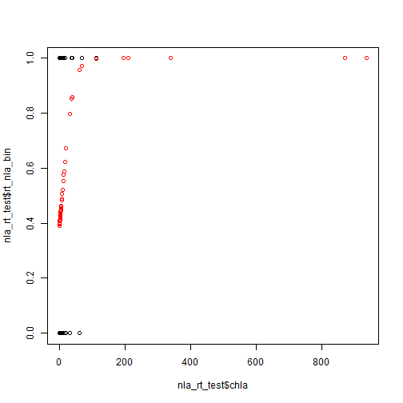
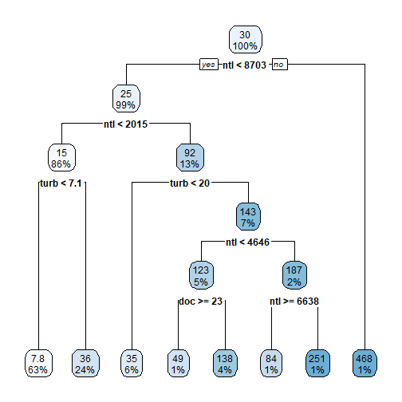
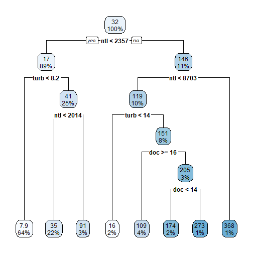
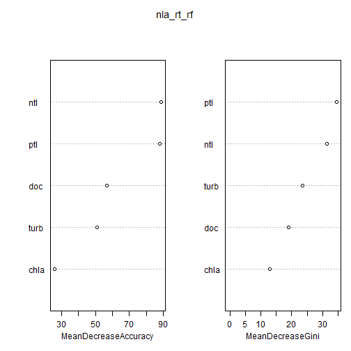
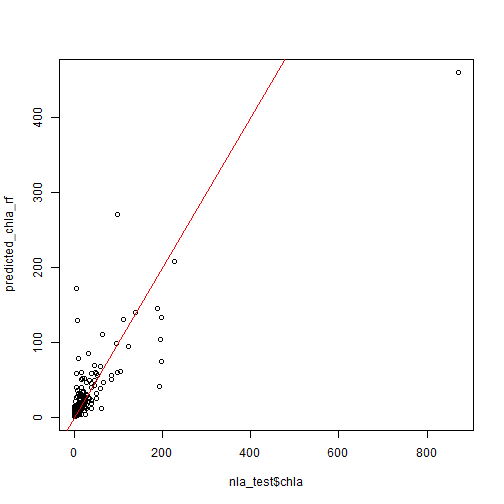

# Modeling grab bag: Re-visit linear models, Logistic Regression, Random Forests, and Broom

The goal of this lesson is to show how to do some modeling, beyond what we have seen with linear models.  The idea is to show the basics such as formulas, model objects, and model evaluation.  You should be able to run these examples, maybe extend their use to other data.  What we won't be covering is the details of how best to use these modelling approaches.  That is for the statisticians, which I am not!!

Before we get started, there are probably a few packages that we will need to install.


```r
install.packages("pscl")
install.packages("rpart")
install.packages("rpart.plot")
install.packages("randomForest")
install.packages("ranger")
install.packages("broom")
devtool::install_github("njtierney/broomstick")
```

We also need to grab some data that we can use for our modelling efforts.  We will use the same data we used for the basic stats lesson, but in this case we will create a testing and a training dataset.


```r
library(dplyr)
library(readr)
library(tidyr)

nla_wq_all <- read_csv("https://www.epa.gov/sites/production/files/2014-10/nla2007_chemical_conditionestimates_20091123.csv")

nla_wq <- nla_wq_all %>%
  rename_all(tolower) %>% #making all names lower case beucase they are a mess!
  mutate_if(is.character, tolower) %>%
  filter(site_type == "prob_lake",
         visit_no == 1) %>%
  select(site_id, st, epa_reg, wsa_eco9, ptl, ntl, turb, chla, doc)

nla_sites <- read_csv("https://www.epa.gov/sites/production/files/2014-01/nla2007_sampledlakeinformation_20091113.csv")

nla_sites <- nla_sites %>%
  filter(VISIT_NO == 1) %>%
  select(SITE_ID, STATE_NAME, CNTYNAME, LAKE_ORIGIN, RT_NLA) %>%
  rename_all(tolower) %>% #making all names lower case because they are a mess!
  mutate_if(is.character, tolower)

nla <- left_join(nla_sites, nla_wq, by = "site_id") %>%
  filter(!is.na(ntl),
         !is.na(chla),
         !is.na(ptl))

index <- 1:nrow(nla)
set.seed(42)
train_index <- sample(index, length(index) * 0.8)
test_index <- index[!index %in% train_index]

nla_train <- slice(nla, train_index)
nla_test <- slice(nla, test_index)

# New dplyr function!
glimpse(nla_train)
```

```
## Rows: 822
## Columns: 13
## $ site_id     <chr> "nla06608-1091", "nla06608-0599", "nla06608-1256", "nla06608-007…
## $ state_name  <chr> "north dakota", "texas", "kansas", "north dakota", "indiana", "n…
## $ cntyname    <chr> "kidder", "burleson", "greenwood", "mchenry", "noble", "santa fe…
## $ lake_origin <chr> "natural", "man-made", "man-made", "natural", "natural", "man-ma…
## $ rt_nla      <chr> "so-so", "so-so", "ref", "so-so", "so-so", "ref", "ref", "so-so"…
## $ st          <chr> "nd", "tx", "ks", "nd", "in", "nm", "il", "ga", "nc", "il", "ok"…
## $ epa_reg     <chr> "region_8", "region_6", "region_7", "region_8", "region_5", "reg…
## $ wsa_eco9    <chr> "npl", "cpl", "tpl", "tpl", "umw", "xer", "tpl", "cpl", "cpl", "…
## $ ptl         <dbl> 90, 90, 20, 136, 36, 14, 8, 20, 1, 133, 79, 8, 77, 819, 78, 277,…
## $ ntl         <dbl> 2503, 1012, 346, 4747, 1826, 217, 178, 420, 86, 2741, 865, 487, …
## $ turb        <dbl> 9.06, 6.31, 3.47, 20.20, 22.10, 3.69, 1.57, 5.13, 1.88, 22.00, 1…
## $ chla        <dbl> 12.67, 50.26, 2.58, 10.02, 55.58, 6.65, 5.07, 12.53, 2.50, 349.2…
## $ doc         <dbl> 26.40, 8.49, 3.41, 49.81, 10.91, 4.09, 4.07, 2.93, 2.80, 15.76, …
```

```r
glimpse(nla_test)
```

```
## Rows: 206
## Columns: 13
## $ site_id     <chr> "nla06608-0005", "nla06608-0006", "nla06608-0019", "nla06608-004…
## $ state_name  <chr> "idaho", "connecticut", "north dakota", "indiana", "north caroli…
## $ cntyname    <chr> "blaine", "litchfield", "logan", "lagrange", "union", "kidder", …
## $ lake_origin <chr> "natural", "man-made", "natural", "natural", "man-made", "natura…
## $ rt_nla      <chr> "ref", "ref", "trash", "so-so", "trash", "so-so", "ref", "trash"…
## $ st          <chr> "id", "ct", "nd", "in", "nc", "nd", "fl", "la", "mo", "nj", "co"…
## $ epa_reg     <chr> "region_10", "region_1", "region_8", "region_5", "region_4", "re…
## $ wsa_eco9    <chr> "wmt", "nap", "npl", "umw", "sap", "npl", "cpl", "cpl", "tpl", "…
## $ ptl         <dbl> 4, 7, 801, 9, 218, 152, 39, 415, 24, 116, 4, 100, 22, 20, 3, 33,…
## $ ntl         <dbl> 85, 184, 7047, 645, 1756, 2834, 420, 2441, 436, 1461, 97, 956, 7…
## $ turb        <dbl> 0.475, 0.901, 45.500, 3.740, 15.400, 12.300, 2.740, 14.400, 3.88…
## $ chla        <dbl> 1.21, 4.08, 4.03, 5.41, 125.40, 2.18, 7.41, 198.72, 10.88, 67.97…
## $ doc         <dbl> 1.45, 3.16, 44.99, 7.22, 9.70, 28.53, 13.24, 8.15, 5.10, 7.25, 1…
```

## Least squares linear models

Let's first revisit linear models.  This will helps us see some of the functions and syntax we will reuse later.  We will build a linear model to predict chlorophyll concentrations in the 2007 NLA lakes.


```r
nla_chla_lm <- lm(chla ~ ptl + ntl + turb + doc, data = nla_train)
summary(nla_chla_lm)
```

```
## 
## Call:
## lm(formula = chla ~ ptl + ntl + turb + doc, data = nla_train)
## 
## Residuals:
##     Min      1Q  Median      3Q     Max 
## -408.97   -9.37   -3.89    3.01  491.77 
## 
## Coefficients:
##              Estimate Std. Error t value Pr(>|t|)    
## (Intercept)  3.479793   2.012643   1.729   0.0842 .  
## ptl          0.001656   0.007430   0.223   0.8237    
## ntl          0.028550   0.001152  24.785  < 2e-16 ***
## turb         0.109053   0.052631   2.072   0.0386 *  
## doc         -1.037193   0.132458  -7.830 1.51e-14 ***
## ---
## Signif. codes:  0 '***' 0.001 '**' 0.01 '*' 0.05 '.' 0.1 ' ' 1
## 
## Residual standard error: 48.78 on 817 degrees of freedom
## Multiple R-squared:  0.5774,	Adjusted R-squared:  0.5753 
## F-statistic: 279.1 on 4 and 817 DF,  p-value: < 2.2e-16
```

Note the formula `chla ~ ptl + ntl + turb + doc`.  This is how we specify model formulas in R.  It represents this general regression formula.

$$
Y \sim \beta_0 + X\beta_1 + X\beta_2 + X\beta_3 + X\beta_4 + \epsilon
$$

We will see it used in the other modelling functions as well.

Also, there is usually some way to quickly get summary results for the model.  Often you can simply type the object name and hit enter and that'll give you the basics, or in the case of an `lm` object you can use `summary()` to get at this information (but see below in the `broom` section for a better, more consistent way).  

Let's look a bit more closely at this `lm` object.  We can now use our testing dataset and create predicted values and then compare those back to the original.  This is another one of those approaches that usually transcends the type of model.


```r
nla_test_predictions <- predict(nla_chla_lm, newdata = nla_test)
plot(nla_test$chla, nla_test_predictions)
abline(0, 1, col = "red")
```



```r
nla_chla_lm_rmse <- sqrt(mean((nla_test_predictions - nla_test$chla)^2))
nla_chla_lm_rmse
```

```
## [1] 29.82033
```


## Logistic Regression

Logistic regression, for those who haven't done it yet (or in a long time (e.g. Jeff)), is for modelling binary outcomes (at least how we are going to see it).  Getting these set up is a little bit more involved that what we saw with linear models.  

We have already loaded up the NLA data, but let's think about which data might work for a logistic regression.  The `rt_nla` column contains information about reference class for each sampled lake.  Looking just at chlorophyll vs reference/trashed is not an awful approach here.  First we need to get our dataset filtered, but we also need to turn our dataset into something that logistic regressions will like, namely a binary vector with 0's and 1's.  


```r
nla_rt <- nla %>%
  filter(rt_nla != "so-so") %>%
  mutate(rt_nla_bin = case_when(rt_nla == "ref" ~
                                  0,
                                rt_nla == "trash" ~
                                  1,
                                TRUE ~ NA_real_))

nla_rt_train <- slice(nla_rt, train_index)
nla_rt_test <- slice(nla_rt, test_index)
```

Now lets plot it with some old school base R!


```r
plot(nla_rt_train$chla, nla_rt_train$rt_nla_bin)
```



Now we have a dataset that lends itself nicely to logistic regression.  Here is how we do that.  Very similar to what we did with `lm`!


```r
nla_rt_logistic <- glm(rt_nla_bin ~ chla, family = binomial, 
                       data = nla_rt_train)

summary(nla_rt_logistic)
```

```
## 
## Call:
## glm(formula = rt_nla_bin ~ chla, family = binomial, data = nla_rt_train)
## 
## Deviance Residuals: 
##      Min        1Q    Median        3Q       Max  
## -2.52633  -1.04086   0.05425   1.10405   1.36898  
## 
## Coefficients:
##             Estimate Std. Error z value Pr(>|z|)    
## (Intercept) -0.46843    0.18340  -2.554   0.0106 *  
## chla         0.05835    0.01342   4.349 1.37e-05 ***
## ---
## Signif. codes:  0 '***' 0.001 '**' 0.01 '*' 0.05 '.' 0.1 ' ' 1
## 
## (Dispersion parameter for binomial family taken to be 1)
## 
##     Null deviance: 341.40  on 253  degrees of freedom
## Residual deviance: 272.56  on 252  degrees of freedom
## AIC: 276.56
## 
## Number of Fisher Scoring iterations: 8
```

With our model run and saved as `nla_rt_logistic`, we can now use that to evaluate it and plot it.

To plot the original data and the predicted data from the model we can do this, again with base R.


```r
predicted_rt_prob <- predict(nla_rt_logistic, newdata = nla_rt_test, 
                             type = "response")
plot(nla_rt_test$chla, nla_rt_test$rt_nla_bin)
points(nla_rt_test$chla, predicted_rt_prob, col = "red")
```



How well did this model do?  Lots(!!) of ways to look at this.  Here are two.


```r
# Psuedo R2
library(pscl)
pR2(nla_rt_logistic)
```

```
## fitting null model for pseudo-r2
```

```
##          llh      llhNull           G2     McFadden         r2ML         r2CU 
## -136.2817019 -170.6987296   68.8340554    0.2016244    0.2373837    0.3211265
```

And here is a way to look at prediction accuracy.  Assume a probability of less than 0.5 is Reference (i.e. 0) and greater than 0.5 is trashed. 


```r
predicted_rt_bin <- ifelse(predicted_rt_prob < 0.5, 0, 1)
accuracy <- sum(predicted_rt_bin == nla_rt_test$rt_nla_bin)/nrow(nla_rt_test)
accuracy
```

```
## [1] 0.6666667
```

```r
table(nla_rt_test$rt_nla_bin, predicted_rt_bin)
```

```
##    predicted_rt_bin
##      0  1
##   0 18  5
##   1 11 14
```

Assuming reference condition is a function of productivity and/or trophic state we could probably do better by adding in more to our model.  


```r
nla_rt_logistic <- glm(rt_nla_bin ~ chla + ptl + ntl + turb + doc, family = binomial(link = "logit"), data = nla_rt_train)
predicted_rt_prob <- predict(nla_rt_logistic, newdata = nla_rt_test, type = "response")
predicted_rt_bin <- ifelse(predicted_rt_prob < 0.5, 0, 1)
accuracy <- sum(predicted_rt_bin == nla_rt_test$rt_nla_bin)/nrow(nla_rt_test)
pR2(nla_rt_logistic)
```

```
## fitting null model for pseudo-r2
```

```
##          llh      llhNull           G2     McFadden         r2ML         r2CU 
##  -83.5223915 -170.6987296  174.3526762    0.5107029    0.4966290    0.6718269
```

```r
accuracy
```

```
## [1] 0.8125
```

```r
table(nla_rt_test$rt_nla_bin, predicted_rt_bin)
```

```
##    predicted_rt_bin
##      0  1
##   0 19  4
##   1  5 20
```

There is SO much more to go over with regards to logistic regression, but hopefully this will get you part of the way there.

## Random Forest

Random forest is a modelling approach the relies on tree-based models, aka Classification and Regression Trees (CART). Typical CART builds a single tree to predict a category, a classification tree, or predict a continuous variable with a regression tree.  Let's look at a CART approach for predicting chlorophyll from the variables in the 2007 NLA we have been using.  We will use the rpart and rpart.plot package for this.


```r
library(rpart)
library(rpart.plot)
nla_just_wq <- select(nla, ptl:doc)
# Note the different syntax in the formula, the "." means use all other variables
nla_chla_tree <- rpart(chla ~ ., data = nla_just_wq)
rpart.plot(nla_chla_tree)
```



This is pretty cool, right?  One problem though is that this is very tuned to the dataset that we have.  We would likely get a different tree with a different dataset. So, for instance...


```r
set.seed(42)
bootstrapped_index <- sample(1:1028, 1028, replace = TRUE)
nla_just_wq_2 <- nla_just_wq[bootstrapped_index,]
summary(nla_just_wq)
```

```
##       ptl              ntl               turb              chla       
##  Min.   :   1.0   Min.   :    5.0   Min.   :  0.237   Min.   :  0.07  
##  1st Qu.:  11.0   1st Qu.:  325.5   1st Qu.:  1.520   1st Qu.:  2.98  
##  Median :  29.0   Median :  586.5   Median :  3.815   Median :  7.79  
##  Mean   : 110.5   Mean   : 1179.2   Mean   : 13.620   Mean   : 29.63  
##  3rd Qu.:  94.5   3rd Qu.: 1210.8   3rd Qu.: 11.200   3rd Qu.: 25.96  
##  Max.   :4679.0   Max.   :26100.0   Max.   :574.000   Max.   :936.00  
##       doc         
##  Min.   :  0.340  
##  1st Qu.:  3.380  
##  Median :  5.575  
##  Mean   :  8.863  
##  3rd Qu.:  8.925  
##  Max.   :290.570
```

```r
summary(nla_just_wq_2)
```

```
##       ptl            ntl             turb              chla              doc         
##  Min.   :   1   Min.   :    5   Min.   :  0.237   Min.   :  0.070   Min.   :  0.340  
##  1st Qu.:  10   1st Qu.:  331   1st Qu.:  1.468   1st Qu.:  2.958   1st Qu.:  3.408  
##  Median :  25   Median :  578   Median :  3.690   Median :  7.720   Median :  5.410  
##  Mean   : 121   Mean   : 1272   Mean   : 15.330   Mean   : 31.456   Mean   :  8.954  
##  3rd Qu.:  94   3rd Qu.: 1223   3rd Qu.: 10.800   3rd Qu.: 26.165   3rd Qu.:  8.805  
##  Max.   :4679   Max.   :26100   Max.   :574.000   Max.   :936.000   Max.   :252.190
```

```r
nla_chla_tree_2 <- rpart(chla ~ ., data = nla_just_wq_2)
rpart.plot(nla_chla_tree_2)
```



Whoa!  Totally different tree!  Random forest takes advantage of this fact,  It generates many different bootstrapped datasets, with permuted variables (e.g., slightly different set of variables for each dataset), and creates many different trees (default with `randomForest` is 1000).  It then uses all the trees to create a single prediction.  If the dependent variable is a category, it uses each tree to "vote" for a category and then the prediction is the category with the most votes.  If the dependent variable is a continuous value, the final models prediction is the average prediction for all trees.

Now, lets build a classification random forest.  We will model the same thing we did with logistic regression, predicting reference vs trashed lakes using the water chemistry data.


```r
library(randomForest)
set.seed(42)
nla_rt_rf <- randomForest(factor(rt_nla_bin) ~ chla + ptl + ntl + turb + doc, 
                          data = nla_rt_train, importance = TRUE, ntree = 5000)
nla_rt_rf
```

```
## 
## Call:
##  randomForest(formula = factor(rt_nla_bin) ~ chla + ptl + ntl +      turb + doc, data = nla_rt_train, importance = TRUE, ntree = 5000) 
##                Type of random forest: classification
##                      Number of trees: 5000
## No. of variables tried at each split: 2
## 
##         OOB estimate of  error rate: 16.14%
## Confusion matrix:
##    0   1 class.error
## 0 82  19   0.1881188
## 1 22 131   0.1437908
```

```r
predicted_rt_bin_rf <- predict(nla_rt_rf, newdata = nla_rt_test)
accuracy <- sum(predicted_rt_bin_rf == nla_rt_test$rt_nla_bin)/nrow(nla_rt_test)
accuracy
```

```
## [1] 0.7916667
```

```r
table(nla_rt_test$rt_nla_bin, predicted_rt_bin_rf)
```

```
##    predicted_rt_bin_rf
##      0  1
##   0 19  4
##   1  6 19
```

In this case the random forest had better overall performance than the logistic regression.  It is usually the case that random forests will out perform many other modelling approaches.  Given this and the **relative** simplicity, I find random forests to be a really good first approach with most modelling problems.  Especially when prediction is the goal.  That being said, we can also use random forest to tease out some information about what is going on with the variables.  One way to do this is with variable importance plots.


```r
varImpPlot(nla_rt_rf)
```



This shows us two measures of accuracy for each of the variables in our model.  We will focus on Mean Decrease in Accuracy.  If you remember, not all variables are included in each of our random forest trees.  Variable importance uses this fact to calculate how well trees without a variable perform vs how well they perform when that variable is included.  So, trees without `ntl` and `ptl` had the biggest drop in accuracy, suggesting the nitrogen and phosphorus are pretty important when it comes to predicting the NLA condition classes.

Finally, let's look at a regression case of random forest and re-run the same model we did initially, predicting chlorophyll with nutrients, turbidity, and dissolved organic carbon.


```r
set.seed(42)
nla_chla_rf <- randomForest(chla ~ ptl + ntl + turb + doc, 
                          data = nla_train, importance = TRUE, ntree = 5000,
                          keep.forest = TRUE)
nla_chla_rf
```

```
## 
## Call:
##  randomForest(formula = chla ~ ptl + ntl + turb + doc, data = nla_train,      importance = TRUE, ntree = 5000, keep.forest = TRUE) 
##                Type of random forest: regression
##                      Number of trees: 5000
## No. of variables tried at each split: 1
## 
##           Mean of squared residuals: 2135.727
##                     % Var explained: 61.83
```

```r
predicted_chla_rf <- predict(nla_chla_rf, newdata = nla_test)
plot(nla_test$chla, predicted_chla_rf)
abline(0, 1, col = "red")
```



```r
nla_chla_rf_rmse <- sqrt(mean((predicted_chla_rf - nla_test$chla)^2))
nla_chla_rf_rmse
```

```
## [1] 26.43092
```

Similar performance to the linear model (i.e. not great in both cases!) but a bit better for the random forest.  We can also look at the variable importance plots as well.


```r
varImpPlot(nla_chla_rf)
```


There are other ways we can explore these random forest models, but we don't have time today to do that.  One thing you can look at on your own are partial dependency plots.  They let us examine a bit more of what is going on with prediction and individual variables.

## Getting information from model object: base and `broom`

Last thing we should cover is how to get key pieces of information out of these different models.  

Each of the models provide information differently and we access it in different ways.


```r
# Linear Models
summary(nla_chla_lm)
```

```
## 
## Call:
## lm(formula = chla ~ ptl + ntl + turb + doc, data = nla_train)
## 
## Residuals:
##     Min      1Q  Median      3Q     Max 
## -408.97   -9.37   -3.89    3.01  491.77 
## 
## Coefficients:
##              Estimate Std. Error t value Pr(>|t|)    
## (Intercept)  3.479793   2.012643   1.729   0.0842 .  
## ptl          0.001656   0.007430   0.223   0.8237    
## ntl          0.028550   0.001152  24.785  < 2e-16 ***
## turb         0.109053   0.052631   2.072   0.0386 *  
## doc         -1.037193   0.132458  -7.830 1.51e-14 ***
## ---
## Signif. codes:  0 '***' 0.001 '**' 0.01 '*' 0.05 '.' 0.1 ' ' 1
## 
## Residual standard error: 48.78 on 817 degrees of freedom
## Multiple R-squared:  0.5774,	Adjusted R-squared:  0.5753 
## F-statistic: 279.1 on 4 and 817 DF,  p-value: < 2.2e-16
```

```r
# Logistic
summary(nla_rt_logistic)
```

```
## 
## Call:
## glm(formula = rt_nla_bin ~ chla + ptl + ntl + turb + doc, family = binomial(link = "logit"), 
##     data = nla_rt_train)
## 
## Deviance Residuals: 
##      Min        1Q    Median        3Q       Max  
## -2.12397  -0.65833   0.00001   0.12062   1.99965  
## 
## Coefficients:
##              Estimate Std. Error z value Pr(>|z|)    
## (Intercept) -1.512777   0.302180  -5.006 5.55e-07 ***
## chla        -0.007052   0.016700  -0.422 0.672828    
## ptl          0.015518   0.005903   2.629 0.008572 ** 
## ntl          0.004132   0.001046   3.949 7.85e-05 ***
## turb         0.066791   0.080583   0.829 0.407188    
## doc         -0.253288   0.073387  -3.451 0.000558 ***
## ---
## Signif. codes:  0 '***' 0.001 '**' 0.01 '*' 0.05 '.' 0.1 ' ' 1
## 
## (Dispersion parameter for binomial family taken to be 1)
## 
##     Null deviance: 341.40  on 253  degrees of freedom
## Residual deviance: 167.04  on 248  degrees of freedom
## AIC: 179.04
## 
## Number of Fisher Scoring iterations: 10
```

```r
# Classification RF
nla_rt_rf
```

```
## 
## Call:
##  randomForest(formula = factor(rt_nla_bin) ~ chla + ptl + ntl +      turb + doc, data = nla_rt_train, importance = TRUE, ntree = 5000) 
##                Type of random forest: classification
##                      Number of trees: 5000
## No. of variables tried at each split: 2
## 
##         OOB estimate of  error rate: 16.14%
## Confusion matrix:
##    0   1 class.error
## 0 82  19   0.1881188
## 1 22 131   0.1437908
```

```r
# Regression RF
nla_chla_rf
```

```
## 
## Call:
##  randomForest(formula = chla ~ ptl + ntl + turb + doc, data = nla_train,      importance = TRUE, ntree = 5000, keep.forest = TRUE) 
##                Type of random forest: regression
##                      Number of trees: 5000
## No. of variables tried at each split: 1
## 
##           Mean of squared residuals: 2135.727
##                     % Var explained: 61.83
```

This is useful, but at this point we are just printing these results to the screen.  It would be better if we could programatically access different parts of the model output.  Say we want to get some of the basic model information.  We can dig into the summary objects and pluck out what we need.  Let's look at one example, linear model.


```r
# Structure of a linear model
str(nla_chla_lm)
```

```
## List of 12
##  $ coefficients : Named num [1:5] 3.47979 0.00166 0.02855 0.10905 -1.03719
##   ..- attr(*, "names")= chr [1:5] "(Intercept)" "ptl" "ntl" "turb" ...
##  $ residuals    : Named num [1:822] -36.02 25.86 -7.65 -79.75 8.81 ...
##   ..- attr(*, "names")= chr [1:822] "1" "2" "3" "4" ...
##  $ effects      : Named num [1:822] -890 874 1312 159 -382 ...
##   ..- attr(*, "names")= chr [1:822] "(Intercept)" "ptl" "ntl" "turb" ...
##  $ rank         : int 5
##  $ fitted.values: Named num [1:822] 48.7 24.4 10.2 89.8 46.8 ...
##   ..- attr(*, "names")= chr [1:822] "1" "2" "3" "4" ...
##  $ assign       : int [1:5] 0 1 2 3 4
##  $ qr           :List of 5
##   ..$ qr   : num [1:822, 1:5] -28.6705 0.0349 0.0349 0.0349 0.0349 ...
##   .. ..- attr(*, "dimnames")=List of 2
##   .. .. ..$ : chr [1:822] "1" "2" "3" "4" ...
##   .. .. ..$ : chr [1:5] "(Intercept)" "ptl" "ntl" "turb" ...
##   .. ..- attr(*, "assign")= int [1:5] 0 1 2 3 4
##   ..$ qraux: num [1:5] 1.03 1 1.01 1.01 1
##   ..$ pivot: int [1:5] 1 2 3 4 5
##   ..$ tol  : num 1e-07
##   ..$ rank : int 5
##   ..- attr(*, "class")= chr "qr"
##  $ df.residual  : int 817
##  $ xlevels      : Named list()
##  $ call         : language lm(formula = chla ~ ptl + ntl + turb + doc, data = nla_train)
##  $ terms        :Classes 'terms', 'formula'  language chla ~ ptl + ntl + turb + doc
##   .. ..- attr(*, "variables")= language list(chla, ptl, ntl, turb, doc)
##   .. ..- attr(*, "factors")= int [1:5, 1:4] 0 1 0 0 0 0 0 1 0 0 ...
##   .. .. ..- attr(*, "dimnames")=List of 2
##   .. .. .. ..$ : chr [1:5] "chla" "ptl" "ntl" "turb" ...
##   .. .. .. ..$ : chr [1:4] "ptl" "ntl" "turb" "doc"
##   .. ..- attr(*, "term.labels")= chr [1:4] "ptl" "ntl" "turb" "doc"
##   .. ..- attr(*, "order")= int [1:4] 1 1 1 1
##   .. ..- attr(*, "intercept")= int 1
##   .. ..- attr(*, "response")= int 1
##   .. ..- attr(*, ".Environment")=<environment: 0x0000026abd5e30b8> 
##   .. ..- attr(*, "predvars")= language list(chla, ptl, ntl, turb, doc)
##   .. ..- attr(*, "dataClasses")= Named chr [1:5] "numeric" "numeric" "numeric" "numeric" ...
##   .. .. ..- attr(*, "names")= chr [1:5] "chla" "ptl" "ntl" "turb" ...
##  $ model        :'data.frame':	822 obs. of  5 variables:
##   ..$ chla: num [1:822] 12.67 50.26 2.58 10.02 55.58 ...
##   ..$ ptl : num [1:822] 90 90 20 136 36 14 8 20 1 133 ...
##   ..$ ntl : num [1:822] 2503 1012 346 4747 1826 ...
##   ..$ turb: num [1:822] 9.06 6.31 3.47 20.2 22.1 3.69 1.57 5.13 1.88 22 ...
##   ..$ doc : num [1:822] 26.4 8.49 3.41 49.81 10.91 ...
##   ..- attr(*, "terms")=Classes 'terms', 'formula'  language chla ~ ptl + ntl + turb + doc
##   .. .. ..- attr(*, "variables")= language list(chla, ptl, ntl, turb, doc)
##   .. .. ..- attr(*, "factors")= int [1:5, 1:4] 0 1 0 0 0 0 0 1 0 0 ...
##   .. .. .. ..- attr(*, "dimnames")=List of 2
##   .. .. .. .. ..$ : chr [1:5] "chla" "ptl" "ntl" "turb" ...
##   .. .. .. .. ..$ : chr [1:4] "ptl" "ntl" "turb" "doc"
##   .. .. ..- attr(*, "term.labels")= chr [1:4] "ptl" "ntl" "turb" "doc"
##   .. .. ..- attr(*, "order")= int [1:4] 1 1 1 1
##   .. .. ..- attr(*, "intercept")= int 1
##   .. .. ..- attr(*, "response")= int 1
##   .. .. ..- attr(*, ".Environment")=<environment: 0x0000026abd5e30b8> 
##   .. .. ..- attr(*, "predvars")= language list(chla, ptl, ntl, turb, doc)
##   .. .. ..- attr(*, "dataClasses")= Named chr [1:5] "numeric" "numeric" "numeric" "numeric" ...
##   .. .. .. ..- attr(*, "names")= chr [1:5] "chla" "ptl" "ntl" "turb" ...
##  - attr(*, "class")= chr "lm"
```

```r
# To get model coefficients
nla_chla_lm$coefficients
```

```
##  (Intercept)          ptl          ntl         turb          doc 
##  3.479792621  0.001656135  0.028549649  0.109053315 -1.037192593
```

```r
# Structure of a linear model summary
str(summary(nla_chla_lm))
```

```
## List of 11
##  $ call         : language lm(formula = chla ~ ptl + ntl + turb + doc, data = nla_train)
##  $ terms        :Classes 'terms', 'formula'  language chla ~ ptl + ntl + turb + doc
##   .. ..- attr(*, "variables")= language list(chla, ptl, ntl, turb, doc)
##   .. ..- attr(*, "factors")= int [1:5, 1:4] 0 1 0 0 0 0 0 1 0 0 ...
##   .. .. ..- attr(*, "dimnames")=List of 2
##   .. .. .. ..$ : chr [1:5] "chla" "ptl" "ntl" "turb" ...
##   .. .. .. ..$ : chr [1:4] "ptl" "ntl" "turb" "doc"
##   .. ..- attr(*, "term.labels")= chr [1:4] "ptl" "ntl" "turb" "doc"
##   .. ..- attr(*, "order")= int [1:4] 1 1 1 1
##   .. ..- attr(*, "intercept")= int 1
##   .. ..- attr(*, "response")= int 1
##   .. ..- attr(*, ".Environment")=<environment: 0x0000026abd5e30b8> 
##   .. ..- attr(*, "predvars")= language list(chla, ptl, ntl, turb, doc)
##   .. ..- attr(*, "dataClasses")= Named chr [1:5] "numeric" "numeric" "numeric" "numeric" ...
##   .. .. ..- attr(*, "names")= chr [1:5] "chla" "ptl" "ntl" "turb" ...
##  $ residuals    : Named num [1:822] -36.02 25.86 -7.65 -79.75 8.81 ...
##   ..- attr(*, "names")= chr [1:822] "1" "2" "3" "4" ...
##  $ coefficients : num [1:5, 1:4] 3.47979 0.00166 0.02855 0.10905 -1.03719 ...
##   ..- attr(*, "dimnames")=List of 2
##   .. ..$ : chr [1:5] "(Intercept)" "ptl" "ntl" "turb" ...
##   .. ..$ : chr [1:4] "Estimate" "Std. Error" "t value" "Pr(>|t|)"
##  $ aliased      : Named logi [1:5] FALSE FALSE FALSE FALSE FALSE
##   ..- attr(*, "names")= chr [1:5] "(Intercept)" "ptl" "ntl" "turb" ...
##  $ sigma        : num 48.8
##  $ df           : int [1:3] 5 817 5
##  $ r.squared    : num 0.577
##  $ adj.r.squared: num 0.575
##  $ fstatistic   : Named num [1:3] 279 4 817
##   ..- attr(*, "names")= chr [1:3] "value" "numdf" "dendf"
##  $ cov.unscaled : num [1:5, 1:5] 1.70e-03 -3.24e-07 -1.10e-07 -6.29e-06 -2.45e-05 ...
##   ..- attr(*, "dimnames")=List of 2
##   .. ..$ : chr [1:5] "(Intercept)" "ptl" "ntl" "turb" ...
##   .. ..$ : chr [1:5] "(Intercept)" "ptl" "ntl" "turb" ...
##  - attr(*, "class")= chr "summary.lm"
```

```r
# To get adjusted R2
summary(nla_chla_lm)$adj.r.squared
```

```
## [1] 0.5753366
```

I never find this stuff that intuitive or easy to remember.  Luckily, there is a tidy-adjacent (officially apart of Tidy Models) package that lets us more consistently get important info from these kinds of statistical objects.  It is `broom` (and a GitHub only package, `njtierney/broomstick` for random forest).  The `broom` package has three main functions:`glance()`, `augment()`, and `tidy()`.  We will look at `glance()` and `tidy()`.  For more, the [`broom` website](https://broom.tidymodels.org) has what you need, and the [Intro vignette](https://broom.tidymodels.org/articles/broom.html) is a good starting place.


```r
library(broom)
library(broomstick)

nla_chla_lm_results <- glance(nla_chla_lm)
nla_chla_lm_model_info <- tidy(nla_chla_lm)
nla_rt_logistic_results <- glance(nla_rt_logistic)
nla_rt_logistic_model_info <- tidy(nla_rt_logistic)
nla_rt_rf_results <- glance(nla_rt_rf)
nla_rt_rf_model_info <- tidy(nla_rt_rf)
nla_chla_rf_results <- glance(nla_chla_rf)
nla_chla_rf_model_info <- tidy(nla_chla_rf)
```

These are nice because instead of having unique lists that we need to dig through from key pieces of information, we now have a data frame that holds all of this!


```r
nla_chla_lm_results
```

```
## # A tibble: 1 × 12
##   r.squared adj.r.s…¹ sigma stati…²   p.value    df logLik   AIC   BIC devia…³ df.re…⁴
##       <dbl>     <dbl> <dbl>   <dbl>     <dbl> <dbl>  <dbl> <dbl> <dbl>   <dbl>   <int>
## 1     0.577     0.575  48.8    279. 3.67e-151     4 -4359. 8730. 8759.  1.94e6     817
## # … with 1 more variable: nobs <int>, and abbreviated variable names ¹​adj.r.squared,
## #   ²​statistic, ³​deviance, ⁴​df.residual
```

```r
nla_chla_lm_model_info
```

```
## # A tibble: 5 × 5
##   term        estimate std.error statistic   p.value
##   <chr>          <dbl>     <dbl>     <dbl>     <dbl>
## 1 (Intercept)  3.48      2.01        1.73  8.42e-  2
## 2 ptl          0.00166   0.00743     0.223 8.24e-  1
## 3 ntl          0.0285    0.00115    24.8   1.44e-101
## 4 turb         0.109     0.0526      2.07  3.86e-  2
## 5 doc         -1.04      0.132      -7.83  1.51e- 14
```

```r
nla_rt_logistic_results
```

```
## # A tibble: 1 × 8
##   null.deviance df.null logLik   AIC   BIC deviance df.residual  nobs
##           <dbl>   <int>  <dbl> <dbl> <dbl>    <dbl>       <int> <int>
## 1          341.     253  -83.5  179.  200.     167.         248   254
```

```r
nla_rt_logistic_model_info
```

```
## # A tibble: 6 × 5
##   term        estimate std.error statistic     p.value
##   <chr>          <dbl>     <dbl>     <dbl>       <dbl>
## 1 (Intercept) -1.51      0.302      -5.01  0.000000555
## 2 chla        -0.00705   0.0167     -0.422 0.673      
## 3 ptl          0.0155    0.00590     2.63  0.00857    
## 4 ntl          0.00413   0.00105     3.95  0.0000785  
## 5 turb         0.0668    0.0806      0.829 0.407      
## 6 doc         -0.253     0.0734     -3.45  0.000558
```

```r
nla_rt_rf_results 
```

```
## # A tibble: 2 × 5
##   class precision recall accuracy f_measure
##   <chr>     <dbl>  <dbl>    <dbl>     <dbl>
## 1 0         0.788  0.812    0.839     0.8  
## 2 1         0.873  0.856    0.839     0.865
```

```r
nla_rt_rf_model_info 
```

```
## # A tibble: 5 × 5
##   term  MeanDecreaseAccuracy MeanDecreaseGini MeanDecreaseAccuracy_sd classwise_impo…¹
##   <chr>                <dbl>            <dbl>                   <dbl> <list>          
## 1 chla                0.0142             12.9                0.000550 <tibble [2 × 3]>
## 2 ptl                 0.103              34.5                0.00117  <tibble [2 × 3]>
## 3 ntl                 0.0899             31.4                0.00101  <tibble [2 × 3]>
## 4 turb                0.0407             23.4                0.000800 <tibble [2 × 3]>
## 5 doc                 0.0338             19.0                0.000593 <tibble [2 × 3]>
## # … with abbreviated variable name ¹​classwise_importance
```

```r
nla_chla_rf_results
```

```
##   mean_mse  mean_rsq
## 1 2169.792 0.6122173
```

```r
nla_chla_rf_model_info
```

```
## # A tibble: 4 × 4
##   term  X.IncMSE IncNodePurity imp_sd
##   <chr>    <dbl>         <dbl>  <dbl>
## 1 ptl       574.       963652.   21.1
## 2 ntl      2192.      1437413.   32.3
## 3 turb     1327.      1065557.   23.1
## 4 doc       516.       790523.   18.9
```

## P.S.: Tidy Models and Non-linear models

We have spent most of this class with a focus on the Tidyverse.  There is a a set of packages in the Tidyverse for modelling.  I haven't used these much but they look promising.  If you have an interest in trying these out, take a look at <https://www.tidymodels.org/>.  The `broom` package is part of Tidy Models. There is also a book, [Tidy Modelling with R](https://www.tmwr.org/) written by the folks who created many of the Tidy Modelling Packages.  I haven't looked closely at it, but I would expect it to be of pretty high quqality as well.

Lastly, I didn't have time to add non linear models to this, but we can do those too. Look at `nls`, `loess`, and `gam` from the `mgcv` package.  Noam Ross has a fantastic self-paced coarse about GAMs: https://noamross.github.io/gams-in-r-course/.
