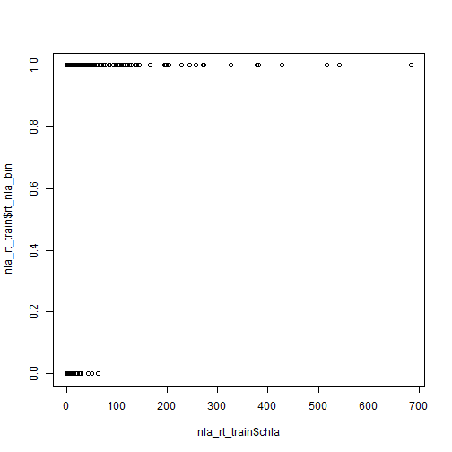
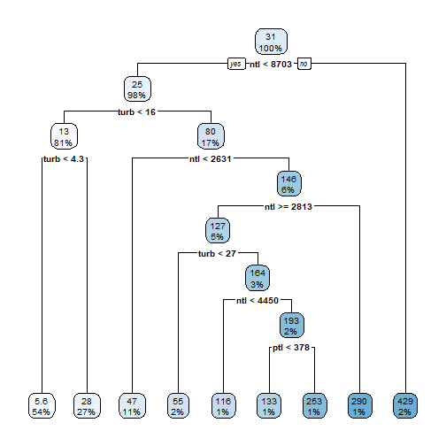
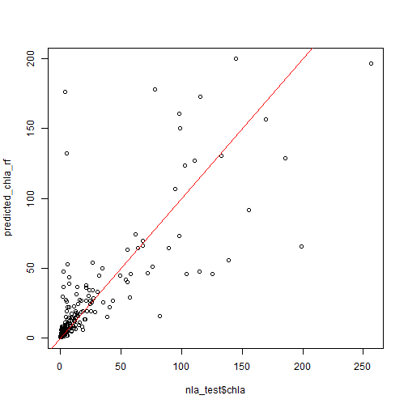

# Modeling grab bag: Re-visit linear models, Logistic Regression, Random 
Forests, and Broom

The goal of this lesson is to show how to do some modeling, beyond what we have seen with linear models.  The idea is to show the basics such as formulas, model objects, and model evaluation.  You should be able to run these examples, maybe extend their use to other data.  What we won't be covering is the details of how best to use these modelling approaches.  That is for the statisticians, which I am not!!

Before we get started, there are probably a few packages that we will need to install.


```r
install.packages("pscl")
install.packages("rpart")
install.packages("rpart.plot")
install.packages("randomForest")
install.packages("ranger")
install.packages("broom")
devtool::install_github("njtierney/broomstick")
```

We also need to grab some data that we can use for our modelling efforts.  We will use the same data we used for the basic stats lesson, but in this case we will create a testing and a training dataset.


```r
library(dplyr)
library(readr)
library(tidyr)

nla_wq_all <- read_csv("https://www.epa.gov/sites/production/files/2014-10/nla2007_chemical_conditionestimates_20091123.csv")

nla_wq <- nla_wq_all %>%
  rename_all(tolower) %>% #making all names lower case beucase they are a mess!
  mutate_if(is.character, tolower) %>%
  filter(site_type == "prob_lake",
         visit_no == 1) %>%
  select(site_id, st, epa_reg, wsa_eco9, ptl, ntl, turb, chla, doc)

nla_sites <- read_csv("https://www.epa.gov/sites/production/files/2014-01/nla2007_sampledlakeinformation_20091113.csv")

nla_sites <- nla_sites %>%
  filter(VISIT_NO == 1) %>%
  select(SITE_ID, STATE_NAME, CNTYNAME, LAKE_ORIGIN, RT_NLA) %>%
  rename_all(tolower) %>% #making all names lower case because they are a mess!
  mutate_if(is.character, tolower)

nla <- left_join(nla_sites, nla_wq, by = "site_id") %>%
  filter(!is.na(ntl),
         !is.na(chla),
         !is.na(ptl))

index <- 1:nrow(nla)
train_index <- sample(index, length(index) * 0.8)
test_index <- index[!index %in% train_index]

nla_train <- slice(nla, train_index)
nla_test <- slice(nla, test_index)
```

## Least squares linear models

Let's first revisit linear models.  This will helps us see some of the functions and syntax we will reuse later.  We will build a linear model to predict chlorophyll concentrations in the 2007 NLA lakes.


```r
nla_chla_lm <- lm(chla ~ ptl + ntl + turb + doc, data = nla_train)
summary(nla_chla_lm)
```

```
## 
## Call:
## lm(formula = chla ~ ptl + ntl + turb + doc, data = nla_train)
## 
## Residuals:
##     Min      1Q  Median      3Q     Max 
## -393.38   -9.16   -4.31    3.13  500.48 
## 
## Coefficients:
##              Estimate Std. Error t value Pr(>|t|)    
## (Intercept)  4.207893   2.012581   2.091   0.0369 *  
## ptl         -0.003036   0.007193  -0.422   0.6731    
## ntl          0.028340   0.001144  24.772  < 2e-16 ***
## turb         0.107564   0.050095   2.147   0.0321 *  
## doc         -1.048930   0.130761  -8.022 3.61e-15 ***
## ---
## Signif. codes:  0 '***' 0.001 '**' 0.01 '*' 0.05 '.' 0.1 ' ' 1
## 
## Residual standard error: 48.31 on 817 degrees of freedom
## Multiple R-squared:  0.5572,	Adjusted R-squared:  0.555 
## F-statistic:   257 on 4 and 817 DF,  p-value: < 2.2e-16
```

Note the formula `chla ~ ptl + ntl + turb + doc`.  This is how we specify model formulas in R.  It represents this general regression formula.

\begin{equation}
Y_i = \beta_0 + \beta_1 X_1 + \beta_2 X_2 + \beta_3 X_3 + \beta_4 X_4 + \epsilon_i
\end{equation}

We will see it used in the other modelling functions as well.

Also, there is usually some way to quickly get summary results for the model.  Often you can simply type the object name and hit enter and that'll give you the basics, or in the case of an `lm` object you can use `summary()` to get at this information (but see below in the `broom` section for a better, more consistent way).  

Let's look a bit more closely at this `lm` object.  We can now use our testing dataset and create predicted values and then compare those back to the original.  This is another one of those approaches that usually transcends the type of model.


```r
nla_test_predictions <- predict(nla_chla_lm, newdata = nla_test)
plot(nla_test$chla, nla_test_predictions)
abline(0, 1, col = "red")
```


```r
nla_chla_lm_rmse <- sqrt(mean((nla_test_predictions - nla_test$chla)^2))
nla_chla_lm_rmse
```

```
## [1] 32.70161
```


## Logistic Regression

Logistic regression, for those who haven't done it yet (or in a long time (e.g. Jeff)), is for modelling binary outcomes (at least how we are going to see it).  Getting these set up is a little bit more involved that what we saw with linear models.  

We have already loaded up the NLA data, but let's think about which data might work for a logistic regression.  The `rt_nla` column contains information about reference class for each sampled lake.  Looking just at chlorophyll vs reference/trashed is not an awful approach here.  First we need to get our dataset filtered, but we also need to turn our dataset into something that logistic regressions will like, namely a binary vector with 0's and 1's.  


```r
nla_rt <- nla %>%
  filter(rt_nla != "so-so") %>%
  mutate(rt_nla_bin = case_when(rt_nla == "ref" ~
                                  0,
                                rt_nla == "trash" ~
                                  1,
                                TRUE ~ NA_real_))

nla_rt_train <- slice(nla_rt, train_index)
nla_rt_test <- slice(nla_rt, test_index)
```

Now lets plot it with some old school base R!


```r
plot(nla_rt_train$chla, nla_rt_train$rt_nla_bin)
```


Now we have a dataset that lends itself nicely to logistic regression.  Here is how we do that.  Very similar to what we did with `lm`!


```r
nla_rt_logistic <- glm(rt_nla_bin ~ chla, family = binomial(link = "logit"), 
                       data = nla_rt_train)

summary(nla_rt_logistic)
```

```
## 
## Call:
## glm(formula = rt_nla_bin ~ chla, family = binomial(link = "logit"), 
##     data = nla_rt_train)
## 
## Deviance Residuals: 
##     Min       1Q   Median       3Q      Max  
## -2.2456  -1.0422   0.0685   1.1593   1.3588  
## 
## Coefficients:
##             Estimate Std. Error z value Pr(>|z|)    
## (Intercept) -0.44859    0.17556  -2.555   0.0106 *  
## chla         0.04655    0.01092   4.263 2.01e-05 ***
## ---
## Signif. codes:  0 '***' 0.001 '**' 0.01 '*' 0.05 '.' 0.1 ' ' 1
## 
## (Dispersion parameter for binomial family taken to be 1)
## 
##     Null deviance: 346.22  on 254  degrees of freedom
## Residual deviance: 282.62  on 253  degrees of freedom
## AIC: 286.62
## 
## Number of Fisher Scoring iterations: 8
```

With our model run and saved as `nla_rt_logistic`, we can now use that to evaluate it and plot it.

To plot the original data and the predicted data from the model we can do this, again with base R.


```r
predicted_rt_prob <- predict(nla_rt_logistic, newdata = nla_rt_test, 
                             type = "response")
plot(nla_rt_test$chla, nla_rt_test$rt_nla_bin)
points(nla_rt_test$chla, predicted_rt_prob, col = "red")
```


How well did this model do?  Lots(!!) of ways to look at this.  Here are two.


```r
# Psuedo R2
library(pscl)
pR2(nla_rt_logistic)
```

```
## fitting null model for pseudo-r2
```

```
##          llh      llhNull           G2     McFadden         r2ML         r2CU 
## -141.3121054 -173.1096605   63.5951102    0.1836845    0.2207260    0.2971724
```

And here is a way to look at prediction accuracy.  Assume a probability of less than 0.5 is Reference (i.e. 0) and greater than 0.5 is trashed. 


```r
predicted_rt_bin <- ifelse(predicted_rt_prob < 0.5, 0, 1)
accuracy <- sum(predicted_rt_bin == nla_rt_test$rt_nla_bin)/nrow(nla_rt_test)
accuracy
```

```
## [1] 0.7446809
```

```r
table(nla_rt_test$rt_nla_bin, predicted_rt_bin)
```

```
##    predicted_rt_bin
##      0  1
##   0 17  1
##   1 11 18
```

Assuming reference condition is a function of productivity and/or trophic state we could probably do better by adding in more to our model.  


```r
nla_rt_logistic <- glm(rt_nla_bin ~ chla + ptl + ntl + turb + doc, family = binomial(link = "logit"), data = nla_rt_train)
predicted_rt_prob <- predict(nla_rt_logistic, newdata = nla_rt_test, type = "response")
predicted_rt_bin <- ifelse(predicted_rt_prob < 0.5, 0, 1)
accuracy <- sum(predicted_rt_bin == nla_rt_test$rt_nla_bin)/nrow(nla_rt_test)
pR2(nla_rt_logistic)
```

```
## fitting null model for pseudo-r2
```

```
##          llh      llhNull           G2     McFadden         r2ML         r2CU 
##  -88.9450928 -173.1096605  168.3291354    0.4861922    0.4832077    0.6505622
```

```r
accuracy
```

```
## [1] 0.8723404
```

```r
table(nla_rt_test$rt_nla_bin, predicted_rt_bin)
```

```
##    predicted_rt_bin
##      0  1
##   0 17  1
##   1  5 24
```

There is SO much more to go over with regards to logistic regression, but hopefully this will get you part of the way there.

## Random Forest

Random forest is a modelling approach the relies on tree-based models, aka Classification and Regression Trees (CART). Typical CART builds a single tree to predict a category, a classification tree, or predict a continuous variable with a regression tree.  Let's look at a CART approach for predicting chlorophyll from the variables in the 2007 NLA we have been using.  We will use the rpart and rpart.plot package for this.


```r
library(rpart)
library(rpart.plot)
nla_just_wq <- select(nla, ptl:doc)
# Note the different syntax in the formula, the "." means use all other variables
nla_chla_tree <- rpart(chla ~ ., data = nla_just_wq)
rpart.plot(nla_chla_tree)
```


This is pretty cool, right?  One problem though is that this is very tuned to the dataset that we have.  We would likely get a different tree with a different dataset. So, for instance...


```r
bootstrapped_index <- sample(1:1028, 1028, replace = TRUE)
nla_just_wq_2 <- nla_just_wq[bootstrapped_index,]
summary(nla_just_wq)
```

```
##       ptl              ntl               turb              chla       
##  Min.   :   1.0   Min.   :    5.0   Min.   :  0.237   Min.   :  0.07  
##  1st Qu.:  11.0   1st Qu.:  325.5   1st Qu.:  1.520   1st Qu.:  2.98  
##  Median :  29.0   Median :  586.5   Median :  3.815   Median :  7.79  
##  Mean   : 110.5   Mean   : 1179.2   Mean   : 13.620   Mean   : 29.63  
##  3rd Qu.:  94.5   3rd Qu.: 1210.8   3rd Qu.: 11.200   3rd Qu.: 25.96  
##  Max.   :4679.0   Max.   :26100.0   Max.   :574.000   Max.   :936.00  
##       doc         
##  Min.   :  0.340  
##  1st Qu.:  3.380  
##  Median :  5.575  
##  Mean   :  8.863  
##  3rd Qu.:  8.925  
##  Max.   :290.570
```

```r
summary(nla_just_wq_2)
```

```
##       ptl              ntl               turb              chla        
##  Min.   :   1.0   Min.   :   28.0   Min.   :  0.278   Min.   :  0.110  
##  1st Qu.:  10.0   1st Qu.:  337.8   1st Qu.:  1.558   1st Qu.:  2.995  
##  Median :  30.0   Median :  624.5   Median :  4.240   Median :  8.750  
##  Mean   : 121.5   Mean   : 1224.6   Mean   : 14.280   Mean   : 31.669  
##  3rd Qu.: 102.0   3rd Qu.: 1235.0   3rd Qu.: 12.750   3rd Qu.: 28.580  
##  Max.   :4679.0   Max.   :26100.0   Max.   :429.000   Max.   :871.200  
##       doc         
##  Min.   :  0.650  
##  1st Qu.:  3.288  
##  Median :  5.455  
##  Mean   :  8.493  
##  3rd Qu.:  8.820  
##  Max.   :114.540
```

```r
nla_chla_tree_2 <- rpart(chla ~ ., data = nla_just_wq_2)
rpart.plot(nla_chla_tree_2)
```



Whoa!  Totally different tree!  Random forest takes advantage of this fact,  It generates many different bootstrapped datasets, with permuted variables (e.g., slightly different set of variables for each dataset), and creates many different trees.  It then uses all the trees to create a single prediction.  If the dependent variable is a category, it uses each tree to "vote" for a category and then the prediction is the category with the most votes.  If the dependent variable is a continuous value, the final models prediction is the average prediction for all trees.

Now, lets build a classification random forest.  We will model the same thing we did with logistic regression, predicting reference vs trashed lakes using the water chemistry data.


```r
library(randomForest)
nla_rt_rf <- randomForest(factor(rt_nla_bin) ~ chla + ptl + ntl + turb + doc, 
                          data = nla_rt_train, importance = TRUE)
nla_rt_rf
```

```
## 
## Call:
##  randomForest(formula = factor(rt_nla_bin) ~ chla + ptl + ntl +      turb + doc, data = nla_rt_train, importance = TRUE) 
##                Type of random forest: classification
##                      Number of trees: 500
## No. of variables tried at each split: 2
## 
##         OOB estimate of  error rate: 18.43%
## Confusion matrix:
##    0   1 class.error
## 0 88  18   0.1698113
## 1 29 120   0.1946309
```

```r
predicted_rt_bin_rf <- predict(nla_rt_rf, newdata = nla_rt_test)
accuracy <- sum(predicted_rt_bin_rf == nla_rt_test$rt_nla_bin)/nrow(nla_rt_test)
accuracy
```

```
## [1] 0.9361702
```

```r
table(nla_rt_test$rt_nla_bin, predicted_rt_bin_rf)
```

```
##    predicted_rt_bin_rf
##      0  1
##   0 17  1
##   1  2 27
```


```r
nla_chla_rf <- randomForest(chla ~ ptl + ntl + turb + doc, 
                          data = nla_train, importance = TRUE)
nla_chla_rf
```

```
## 
## Call:
##  randomForest(formula = chla ~ ptl + ntl + turb + doc, data = nla_train,      importance = TRUE) 
##                Type of random forest: regression
##                      Number of trees: 500
## No. of variables tried at each split: 1
## 
##           Mean of squared residuals: 2084.272
##                     % Var explained: 60.21
```

```r
predicted_chla_rf <- predict(nla_chla_rf, newdata = nla_test)
plot(nla_test$chla, predicted_chla_rf)
abline(0, 1, col = "red")
```



```r
nla_chla_rf_rmse <- sqrt(mean((predicted_chla_rf - nla_test$chla)^2))
nla_chla_rf_rmse
```

```
## [1] 31.80912
```

## `broom`

## Tidy Models

## P.S.: Non-linear models

I didn't have time to add non linear models to this, but we can do those too. Look at `nls`, `loess`, and `gam` from the `mgcv` package.  Noam Ross has a fantastic self-paced coarse about GAMs: https://noamross.github.io/gams-in-r-course/.
