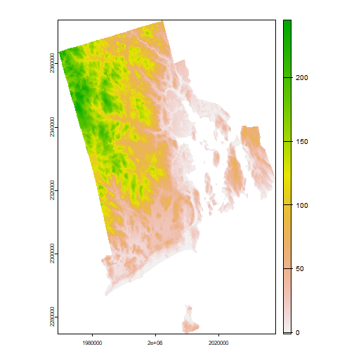
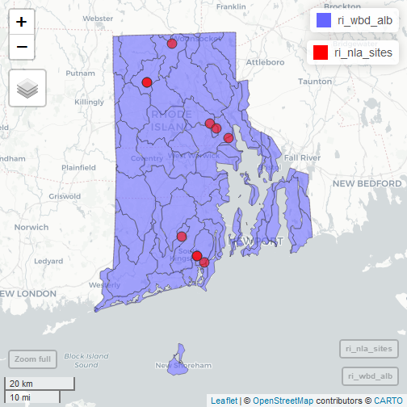

# Geospatial Analysis (aka GIS) in R

Believe it or not, you can meet all your GIS and geospatial analysis needs using only R! We will introduce this today and we will cover the basics of how to read in and write spatial data with R, geospatial data packages, and options for making maps. This will be a very high level overview and we will only be scratching the surface, but should at least get you started on the right path to learn more.

Like all things in the R community, there are many options for learning about geospatial work in R. One that I find particularly good is [Geocomputation with R](https://r.geocompx.org/index.html). For an annotated list of spatial packages, the [CRAN Task View: Analysis of Spatial Data](https://cran.r-project.org/web/views/Spatial.html) is still a good, if a bit overwhelming, resource.

I also won't be spending too much time on covering the basics of spatial data and the rest of this lesson assumes you know the basics of vector data (e.g., points, lines, and polygons) and raster data (e.g., pixels, images, etc.).

None of these capabilities are part of base R, as such you will need to make sure that all of the packages have been installed. The code block below will take care of that for you.


```r
install.packages("sf")
install.packages("terra")
install.packages("elevatr")
install.packages("USAboundaries")
install.packages("USAboundariesData", repos = "https://ropensci.r-universe.dev", 
                 type = "source")
install.packages("mapview")
install.packages("ggspatial")
install.packages("FedData")
install.packages("tidyterra")
```

## Vector data with `sf`

The main package for working with vectore data in the R Spatial ecosystem is the `sf` package. With `sf` we can read in a wide variety of vector data types. We will see one common example that folks at EPA will encounter: the venerable shapefile. We will also see how to turn data (e.g., x and y locations) into an `sf` object.

A shapefile is actually a collection of files. We can get one from <https://www.epa.gov/system/files/other-files/2022-07/NLA17_polgons.zip>. This is the 2017 lakes The code below includes a function that will download these files for you.


```r
library(sf)
```

```
## Linking to GEOS 3.9.3, GDAL 3.5.2, PROJ 8.2.1;
## sf_use_s2() is TRUE
```

```r
# This is a bit of a rabbit hole/added complexity
# Short answer, there a gazillion options that you
# can control for all sorts of things.  This sets
# options for plotting sf objects.
options(sf_max.plot=1)


# Download data
download.file("https://www.epa.gov/system/files/other-files/2022-07/NLA17_polgons.zip", "nla17_lake_polygons.zip")

# Unzip file
unzip("nla17_lake_polygons.zip", junkpaths = T)

# Read in Vector
nla17_lakes <- st_read("NLA_2017_Lake_Polygon.shp")
```

```
## Reading layer `NLA_2017_Lake_Polygon' from data source 
##   `C:\Users\JHollist\projects\acesd_intro_r\lessons\NLA_2017_Lake_Polygon.shp' 
##   using driver `ESRI Shapefile'
## Simple feature collection with 1096 features and 2 fields
## Geometry type: MULTIPOLYGON
## Dimension:     XY
## Bounding box:  xmin: -2294144 ymin: 336576.5 xmax: 2204029 ymax: 3128293
## Projected CRS: Albers
```

```r
nla17_lakes
```

```
## Simple feature collection with 1096 features and 2 fields
## Geometry type: MULTIPOLYGON
## Dimension:     XY
## Bounding box:  xmin: -2294144 ymin: 336576.5 xmax: 2204029 ymax: 3128293
## Projected CRS: Albers
## First 10 features:
##           SITE_ID     COMID
## 1  NLA17_VA-HP007  10062553
## 2  NLA17_SC-10002 166756746
## 3  NLA17_NY-10025  22026848
## 4  NLA17_LA-10004  15108649
## 5  NLA17_SD-10053 120053557
## 6  NLA17_TX-10004  19980072
## 7  NLA17_NM-10049  17843236
## 8  NLA17_ME-10019    806169
## 9  NLA17_ME-10040   4290227
## 10 NLA17_ME-10039   4287237
##                          geometry
## 1  MULTIPOLYGON (((1671056 176...
## 2  MULTIPOLYGON (((1412918 130...
## 3  MULTIPOLYGON (((1579017 237...
## 4  MULTIPOLYGON (((309181.1 77...
## 5  MULTIPOLYGON (((-275133.1 2...
## 6  MULTIPOLYGON (((-500846.9 1...
## 7  MULTIPOLYGON (((-939685 157...
## 8  MULTIPOLYGON (((2105577 291...
## 9  MULTIPOLYGON (((1997377 283...
## 10 MULTIPOLYGON (((2041918 297...
```

```r
plot(nla17_lakes)
```


Another common thing is to have a tabular dataset with Longitude and Latitude columns. We can take that data and turn it into an `sf` object that we can then do spatial analysis with. We have this with the 2017 NLA that we used as part of the `acesd_analysis.R` script. Here is that code (with a few small changes).


```r
library(readr)
library(dplyr)
```

```
## 
## Attaching package: 'dplyr'
```

```
## The following objects are masked from 'package:stats':
## 
##     filter, lag
```

```
## The following objects are masked from 'package:base':
## 
##     intersect, setdiff, setequal, union
```

```r
library(tidyr)
library(lubridate)
```

```
## 
## Attaching package: 'lubridate'
```

```
## The following objects are masked from 'package:base':
## 
##     date, intersect, setdiff, union
```

```r
nla_2017_chem <- read_csv("data/nla_2017_water_chemistry_chla-data.csv", 
                          guess_max = 23000)
```

```
## Rows: 22873 Columns: 23
```

```
## ── Column specification ─────────────────────────────────
## Delimiter: ","
## chr (17): PUBLICATION_DATE, SITE_ID, DATE_COL, STUDY,...
## dbl  (6): UID, VISIT_NO, MDL, RL, HOLDING_TIME, LAB_S...
## 
## ℹ Use `spec()` to retrieve the full column specification for this data.
## ℹ Specify the column types or set `show_col_types = FALSE` to quiet this message.
```

```r
nla_2017_chem_clean <- nla_2017_chem |>
  rename_all(tolower) |>
  select(uid:visit_no, state, analyte, result, nars_flag) |>
  filter(is.na(nars_flag), visit_no == 1) |>
  select(-nars_flag) |>
  mutate(date_col = dmy(date_col), 
         analyte = tolower(analyte),
         result = as(result, "numeric")) |>
  select(uid:date_col, state:result)
```

```
## Warning: There was 1 warning in `mutate()`.
## ℹ In argument: `result = as(result, "numeric")`.
## Caused by warning in `asMethod()`:
## ! NAs introduced by coercion
```

```r
nla_2017_sites <- read_csv("https://www.epa.gov/sites/default/files/2021-04/nla_2017_site_information-data.csv")
```

```
## Rows: 5721 Columns: 80
## ── Column specification ─────────────────────────────────
## Delimiter: ","
## chr (60): PUBLICATION_DATE, SITE_ID, DATE_COL, SITESA...
## dbl (20): UID, VISIT_NO, AREA_HA, COMID, ELEVATION, F...
## 
## ℹ Use `spec()` to retrieve the full column specification for this data.
## ℹ Specify the column types or set `show_col_types = FALSE` to quiet this message.
```

```r
nla_wq_sites <- nla_2017_sites |>
  select(uid = UID, site_id = SITE_ID, cntyname = CNTYNAME, lon_dd83 = LON_DD83,
         lat_dd83 = LAT_DD83) |>
  filter(!is.na(uid)) |>
  left_join(nla_2017_chem_clean, by = c("uid" = "uid"), multiple = "all") |>
  pivot_wider(names_from = "analyte", values_from = "result")
glimpse(nla_wq_sites)
```

```
## Rows: 1,210
## Columns: 32
## $ uid               <dbl> 2010177, 2010178, 2010179, 20…
## $ site_id.x         <chr> "NLA17_NV-10018", "NLA17_NV-1…
## $ cntyname          <chr> "Washoe", "Washoe", "Kidder",…
## $ lon_dd83          <dbl> -119.77890, -119.78980, -99.7…
## $ lat_dd83          <dbl> 39.54188, 39.45780, 47.17341,…
## $ site_id.y         <chr> "NLA17_NV-10018", "NLA17_NV-1…
## $ date_col          <date> 2017-05-30, 2017-05-31, 2017…
## $ state             <chr> "NV", "NV", "ND", "NV", "OH",…
## $ doc               <dbl> 7.72, 7.12, 27.17, 62.55, 6.9…
## $ silica            <dbl> 6.996, 33.686, 14.273, 2.726,…
## $ chloride          <dbl> 101.625, 8.668, 119.687, 5693…
## $ cond              <dbl> 2172.4, 333.4, 3206.2, 29931.…
## $ nitrate_n         <dbl> 0.1623, 0.0196, 0.0507, 1.063…
## $ ph                <dbl> 7.95, 8.45, 8.92, 9.40, 7.90,…
## $ chla              <dbl> 5.19, 12.16, 6.14, 0.60, 305.…
## $ ntl               <dbl> 1.343, 0.900, 2.750, 2.323, 1…
## $ turb              <dbl> 3.16, 2.72, 2.68, 0.68, 10.57…
## $ ammonia_n         <dbl> 0.599, 0.027, 0.014, 0.086, 0…
## $ sulfate           <dbl> 1004.914, 20.639, 1229.337, 5…
## $ color             <dbl> 25, 27, 35, 5, 35, 3, 10, 5, …
## $ anc               <dbl> 2496.93, 2681.74, 9739.84, NA…
## $ ptl               <dbl> 92.32500, 234.69500, 63.34750…
## $ nitrite_n         <dbl> 0.020, 0.000, 0.000, 0.000, 0…
## $ magnesium         <dbl> NA, 12.867, 251.264, 160.715,…
## $ calcium           <dbl> NA, 30.447, 27.385, 11.668, 1…
## $ potassium         <dbl> NA, NA, 70.860, 397.076, 2.54…
## $ sodium            <dbl> NA, NA, NA, NA, NA, NA, NA, 8…
## $ `NA`              <dbl> NA, NA, NA, NA, NA, NA, NA, N…
## $ aluminum          <dbl> NA, NA, NA, NA, NA, NA, NA, N…
## $ tkn               <dbl> NA, NA, NA, NA, NA, NA, NA, N…
## $ batch_id          <dbl> NA, NA, NA, NA, NA, NA, NA, N…
## $ nitrate_nitrite_n <dbl> NA, NA, NA, NA, NA, NA, NA, N…
```

So we now have our full NLA dataset and it has two columns, `lon_dd83` and `lat_dd83`, that we can use to create an `sf` object.  We can do that with the following


```r
nla_wq_sites <- st_as_sf(nla_wq_sites, 
                         coords = c("lon_dd83", "lat_dd83"),
                         crs = 4326)
nla_wq_sites
```

```
## Simple feature collection with 1210 features and 30 fields
## Geometry type: POINT
## Dimension:     XY
## Bounding box:  xmin: -124.4373 ymin: 26.07154 xmax: -67.69865 ymax: 48.97325
## Geodetic CRS:  WGS 84
## # A tibble: 1,210 × 31
##        uid site_…¹ cntyn…² site_…³ date_col   state   doc
##  *   <dbl> <chr>   <chr>   <chr>   <date>     <chr> <dbl>
##  1 2010177 NLA17_… Washoe  NLA17_… 2017-05-30 NV     7.72
##  2 2010178 NLA17_… Washoe  NLA17_… 2017-05-31 NV     7.12
##  3 2010179 NLA17_… Kidder  NLA17_… 2017-06-01 ND    27.2 
##  4 2010180 NLA17_… Mineral NLA17_… 2017-06-01 NV    62.6 
##  5 2010181 NLA17_… Geauga  NLA17_… 2017-06-01 OH     6.92
##  6 2010182 NLA17_… Maury   NLA17_… 2017-06-02 TN     3.9 
##  7 2010183 NLA17_… Yavapai NLA17_… 2017-06-01 AZ    10.6 
##  8 2010184 NLA17_… Muskeg… NLA17_… 2017-06-05 MI     5.29
##  9 2010185 NLA17_… Kidder  NLA17_… 2017-06-05 ND    17.1 
## 10 2010186 NLA17_… Marin   NLA17_… 2017-06-05 CA     4   
## # … with 1,200 more rows, 24 more variables:
## #   silica <dbl>, chloride <dbl>, cond <dbl>,
## #   nitrate_n <dbl>, ph <dbl>, chla <dbl>, ntl <dbl>,
## #   turb <dbl>, ammonia_n <dbl>, sulfate <dbl>,
## #   color <dbl>, anc <dbl>, ptl <dbl>, nitrite_n <dbl>,
## #   magnesium <dbl>, calcium <dbl>, potassium <dbl>,
## #   sodium <dbl>, `NA` <dbl>, aluminum <dbl>, …
```

```r
glimpse(nla_wq_sites)
```

```
## Rows: 1,210
## Columns: 31
## $ uid               <dbl> 2010177, 2010178, 2010179, 20…
## $ site_id.x         <chr> "NLA17_NV-10018", "NLA17_NV-1…
## $ cntyname          <chr> "Washoe", "Washoe", "Kidder",…
## $ site_id.y         <chr> "NLA17_NV-10018", "NLA17_NV-1…
## $ date_col          <date> 2017-05-30, 2017-05-31, 2017…
## $ state             <chr> "NV", "NV", "ND", "NV", "OH",…
## $ doc               <dbl> 7.72, 7.12, 27.17, 62.55, 6.9…
## $ silica            <dbl> 6.996, 33.686, 14.273, 2.726,…
## $ chloride          <dbl> 101.625, 8.668, 119.687, 5693…
## $ cond              <dbl> 2172.4, 333.4, 3206.2, 29931.…
## $ nitrate_n         <dbl> 0.1623, 0.0196, 0.0507, 1.063…
## $ ph                <dbl> 7.95, 8.45, 8.92, 9.40, 7.90,…
## $ chla              <dbl> 5.19, 12.16, 6.14, 0.60, 305.…
## $ ntl               <dbl> 1.343, 0.900, 2.750, 2.323, 1…
## $ turb              <dbl> 3.16, 2.72, 2.68, 0.68, 10.57…
## $ ammonia_n         <dbl> 0.599, 0.027, 0.014, 0.086, 0…
## $ sulfate           <dbl> 1004.914, 20.639, 1229.337, 5…
## $ color             <dbl> 25, 27, 35, 5, 35, 3, 10, 5, …
## $ anc               <dbl> 2496.93, 2681.74, 9739.84, NA…
## $ ptl               <dbl> 92.32500, 234.69500, 63.34750…
## $ nitrite_n         <dbl> 0.020, 0.000, 0.000, 0.000, 0…
## $ magnesium         <dbl> NA, 12.867, 251.264, 160.715,…
## $ calcium           <dbl> NA, 30.447, 27.385, 11.668, 1…
## $ potassium         <dbl> NA, NA, 70.860, 397.076, 2.54…
## $ sodium            <dbl> NA, NA, NA, NA, NA, NA, NA, 8…
## $ `NA`              <dbl> NA, NA, NA, NA, NA, NA, NA, N…
## $ aluminum          <dbl> NA, NA, NA, NA, NA, NA, NA, N…
## $ tkn               <dbl> NA, NA, NA, NA, NA, NA, NA, N…
## $ batch_id          <dbl> NA, NA, NA, NA, NA, NA, NA, N…
## $ nitrate_nitrite_n <dbl> NA, NA, NA, NA, NA, NA, NA, N…
## $ geometry          <POINT [°]> POINT (-119.7789 39.541…
```

```r
plot(st_geometry(nla_wq_sites))
```


See that last column?  That is what makes this a spatial object.  All the geographic `POINT` information is held in this column.  Same applies if we had `LINESTRING`, `POLYGONS`, etc.  These are acceptable "Simple Features" which are a widely used spatial data format.

So, we have now created some objects in R that hold vector data by reading in an external shapefile and by using longitude and latitude columns.

### Note on coordinate reference systems

I gloss over the details of a coordinate reference system (CRS) in this lesson, but choosing and managing the CRS for a given analysis is something that should not be taken lightly. The CRS will impact all of your spatial measurements (area, distance, shape, etc.) and whichever you choose will need to be appropriate to the goals of your analysis. Furthermore, you will need to manage the CRS such that all of your spatial data have one defined and have been transformed into the same CRS. I suggest you consult a GIS person for advice on this and I am happy to provide options and walk you through managing the CRS in R.

## Raster data with `terra`

Let's now look at how to read in raster datasets in R.  These often are made available as image file formats and a very common one is the geotiff.  There is one in the classes repository on GitHub.  We can access that directly with:


```r
library(terra)
```

```
## terra 1.7.18
```

```
## 
## Attaching package: 'terra'
```

```
## The following object is masked from 'package:tidyr':
## 
##     extract
```

```r
nlcd <- rast("https://github.com/USEPA/acesd_intro_r/raw/main/lessons/nlcd_2016/nlcd_2016_ri_NLCD_Land_Cover_2016.tif")
plot(nlcd)
```


This creates a `terra` `SpatRaster` object.  There is a lot we can do with these via the `terra` package.  We will also use the `tidyterra` package later to help with plotting.  Unfortunately, we won't have time to delve into these objects too much.

## Geospatial data packages

In addition to reading in datasets directly from a file, there are many packages that have been written that provide access, through various methods, to spatial data.  We will talk about three: `USAboundaries`, `elevatr`, and `FedData`.

The `USAboundaries` package provides access to, um, well, boundaries for the USA.  This package is a little unique in that we can install it directly from CRAN, but there is also another package, not on CRAN, that holds the data: `USAboundariesData`.  It is set up this way because the data itself is too large to be hosted on CRAN.  The extra package is hosted elsewhere.  When you load up `USAboundaries` it checks that you have `USAboundariesData` and will helpfully provide you the function needed to install it.  Once you have both, you can dig into the package.  Let's work on getting a Rhode Island boundary.


```r
library(USAboundaries)

us <- us_states(resolution = "high")
plot(us)
```


This provides us an `sf` object of the polygons for all the state boundaries.  One of the neat things about `sf` is the objects are just a data frame with some extra bits.  Becuase they are data frames, we already know how to do a lot of stuff with them becuase we can use the Tidyverse tools that we have worked with, such as `dplyr`.  So to just get the Rhode Island boundary we can use `filter`.


```r
library(dplyr)
ri <- filter(us, state_name == "Rhode Island")
ri
```

```
## Simple feature collection with 1 feature and 12 fields
## Geometry type: MULTIPOLYGON
## Dimension:     XY
## Bounding box:  xmin: -71.86277 ymin: 41.14634 xmax: -71.12057 ymax: 42.0188
## Geodetic CRS:  WGS 84
##   statefp  statens    affgeoid geoid stusps         name
## 1      44 01219835 0400000US44    44     RI Rhode Island
##   lsad      aland     awater   state_name state_abbr
## 1   00 2677759219 1323691129 Rhode Island         RI
##   jurisdiction_type                       geometry
## 1             state MULTIPOLYGON (((-71.28802 4...
```

```r
plot(ri)
```


Now that we have our Rhode Island boundary, we can use that to filter, spatially, our NLA sites and waterbodies.  We also need to deal with the CRS for this and our subsequent mapping to work out.


```r
ri_alb <- st_transform(ri, crs = crs(nlcd))
nla_wq_sites_alb <- st_transform(nla_wq_sites, crs = crs(nlcd))
ri_nla_lakes <- st_intersection(ri_alb, nla17_lakes)
```

```
## Warning: attribute variables are assumed to be spatially
## constant throughout all geometries
```

```r
ri_nla_sites <- st_intersection(ri_alb, nla_wq_sites_alb)
```

```
## Warning: attribute variables are assumed to be spatially
## constant throughout all geometries
```

```r
ri_nlcd <- terra::mask(nlcd, ri_alb)
```

Next, let's get some elevation data with the `elevatr` package (full disclosure, this is one of mine!)  We can use the Rhode Island boundary and pull elevation data from the AWS Terrain Tiles.  The only trick we will have is that `elevatr` is still using the older spatial packages, most notable `raster`, but we can convert that easily to a `SpatRaster`.


```r
library(elevatr)
ri_elev <- get_elev_raster(ri_alb, z = 10, clip = "locations") |>
  rast()
```

```
## Warning: PROJ support is provided by the sf and terra
## packages among others

## Warning: PROJ support is provided by the sf and terra
## packages among others
```

```
## 
 Accessing raster elevation [-------------------------]   0%
 Accessing raster elevation [>------------------------]   4%
 Accessing raster elevation [=>-----------------------]   8%
 Accessing raster elevation [==>----------------------]  12%
 Accessing raster elevation [===>---------------------]  16%
 Accessing raster elevation [====>--------------------]  20%
 Accessing raster elevation [=====>-------------------]  24%
 Accessing raster elevation [======>------------------]  28%
 Accessing raster elevation [=======>-----------------]  32%
 Accessing raster elevation [========>----------------]  36%
 Accessing raster elevation [=========>---------------]  40%
 Accessing raster elevation [==========>--------------]  44%
 Accessing raster elevation [===========>-------------]  48%
 Accessing raster elevation [============>------------]  52%
 Accessing raster elevation [=============>-----------]  56%
 Accessing raster elevation [==============>----------]  60%
 Accessing raster elevation [===============>---------]  64%
 Accessing raster elevation [================>--------]  68%
 Accessing raster elevation [=================>-------]  72%
 Accessing raster elevation [==================>------]  76%
 Accessing raster elevation [===================>-----]  80%
 Accessing raster elevation [====================>----]  84%
 Accessing raster elevation [=====================>---]  88%
 Accessing raster elevation [======================>--]  92%
 Accessing raster elevation [=======================>-]  96%
 Accessing raster elevation [=========================] 100%
## Mosaicing & Projecting
## Clipping DEM to locations
```

```
## Warning: PROJ support is provided by the sf and terra
## packages among others
```

```
## Note: Elevation units are in meters.
```

```r
plot(ri_elev)
```



Lastly, there is a very useful package for grabbing a whole lot of Federal spatial data, `FedData`.  This package was peer reviewed by and is now a part of the [rOpenSci](https://ropensci.org) project (if you are interested in rOpenSci software peer review, let me know).  I have used `FedData` to get SSURGO soils, NLCD land use/land cover, NLCD impervious surface, NHD, etc.  For today, we will use it to grab watershed boundaries.


```r
library(FedData)
ri_wbd <- get_wbd(ri, label = "ri", force.redo = TRUE) 
ri_wbd_alb <- st_transform(ri_wbd, crs = crs(ri_alb))
ri_wbd_alb <- st_intersection(ri_alb, ri_wbd_alb)
```

```
## Warning: attribute variables are assumed to be spatially
## constant throughout all geometries
```

```r
plot(ri_wbd_alb)
```


## Static maps with default plotting, `ggplot2` and `ggspatial`

We have seen some simple plots so far using the generic plotting functions for `terra` and `sf` objects.  We can even adorn those a bit and get a passable map.  


```r
plot(nlcd, main = "Rhode Island Land Cover")
plot(ri_alb, add = TRUE, col = NA, border = "grey30", lwd = 2)
```

```
## Warning in plot.sf(ri_alb, add = TRUE, col = NA, border
## = "grey30", lwd = 2): ignoring all but the first
## attribute
```


But this is a syntax different than what we have already learned with `ggplot2` and if you want to get a bit more fancy with your plots, that will be much easier to accomplish with `ggplot2`.  In addition to `ggplot2`, we need to load up the `tidyterra` package.  The two packages we rely on for working with spatial data have had a bit of convergent evolution and have arrived at a somewhat similar place, albeit with some distinctions. Becuase of this `terra` isn't immediately workable with our Tidy ways.  The `tidyterra` package should make it a little bit easier as we can use it to force `terra` `SpatRaster` objects into a tidy workflow.


```r
library(tidyterra)
```

```
## 
## Attaching package: 'tidyterra'
```

```
## The following object is masked from 'package:stats':
## 
##     filter
```

```r
library(ggplot2)
library(ggspatial)
ri_nlcd_gg <- ggplot(ri_elev) +
  geom_spatraster(data = ri_elev) +
  geom_sf(data = ri_alb, alpha = 0.25, size = 3) +
  geom_sf(data = ri_nla_sites) +
  geom_sf(data = ri_wbd_alb, fill = "grey30", alpha = 0.1) +
  scale_fill_continuous(na.value = NA) +
  annotation_north_arrow(pad_y = unit(1, "cm")) +
  annotation_scale() +
  labs(title = "Rhode Island NLA Sites", x = "Longitude", y = "Latitude")
```

```
## SpatRaster resampled to ncells = 500910
```

```r
ri_nlcd_gg
```


Not terribly pretty, but with some more tweaking we can easily get there.

## Interactive maps with `mapview`

Static maps are great for figures, but often we need to be able to interact with our spatial data.  The best way to do that is utilize some of the great web based tools (i.e. javascript) to add our spatial data to something akin to an online map.  The easiet way to do that is with the `mapview` package.


```r
library(mapview)

mapview(ri_wbd_alb) + mapview(ri_nla_sites, col.regions = "red") 
```



Pretty cool!

That is all we are going to cover today.  It is a TINY bit of what you can do with spatial data in R.  In fact, I think you can likely do more with spatial data in R than you can with a standalone GIS (e.g. spatial modelling is all inherent in R).
