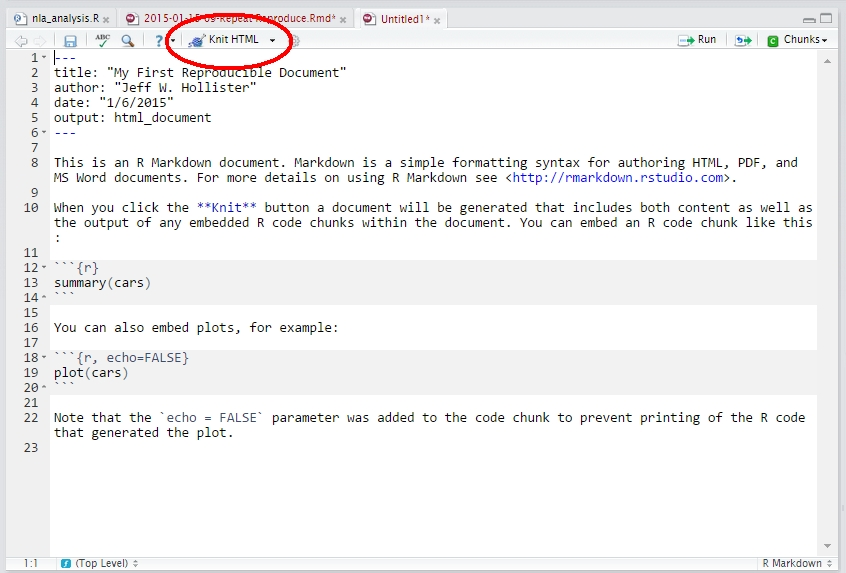

# Reproducible Research: Closing the loop with QA and Products

Up to this point we have learned a lot and seen many different things that we can do with R.  But one of the topics we haven't really covered is how do we capture this work, weave it in with the products we create (e.g. presentations and papers), and share the analysis so that others can reproduce the results and check the quality of the work.  To do this, we will cover the basic concepts of reproducibility and discuss the types of files needed (e.g. scripts, R Markdown/Quarto documents, folders, etc.) to facilitate others using our analysis.   

## What is reproducibility and what do you need to share?

Reproducibility in science is a very broad topic and even the definition of the assocaited terms (e.g., reproduce and replicate) are not universally agreed upon.  But the consensus that I have begun to see is that reproducibility relates to reproducing the same results with the same code and data.  This can also be referred to as "computational reproducibility".  Replicating a study relates to getting similar results but with a new study and new data.  These definitions are consitent with how the National Academies define reproducibility and replicability in a 2019 publication (https://nap.nationalacademies.org/catalog/25303/reproducibility-and-replicability-in-science).

In this lesson, we focus on computational reproducibility, how we can achieve that using R, and what we should plan on sharing to ensure proper QA and review.

## Computational reproducibility with scripts and documents

You may not have realized it, but throughout our class we have been working in a reproducible fashion.  The exercises that we are working on all have code that is saved as a `.R` script and those scripts include all of the bits and pieces we would need to successfully re-run the code.  The bare minimum that we need in order for our work to be reproduced (and thus reviewed) by someone else is:

- Details on the computational environment
- Code
- All of the data the code uses
- Documentation

Let's look at each of these in a little more depth.

### Details on the computational environment

There are shades of grey on this one as the amount of detail ranges from simple to complex.  On the complex side of things a reproducible analysis would include access to the entire computational environment including operating system and version, all system dependencies, exact R version, and exact R package versions  This is often done with something like a [Docker](https://www.docker.com/) files/containers or [Binder](https://mybinder.org/) executable environments and exact package versions managed through something like [`renv`](https://cran.r-project.org/web/packages/renv/index.html).  For our first forays into reproducible work, we are not going to go this far.  

What we all should strive for as a minimum level of information is details on the R version, R packages (and versions), and a snapshot of the operating system details.  We can do this with what we currently know about R.

First, how should we deal with providing details on R packages?  We will need to make sure our code can deal with the packages and that we provide the details to users of versions.  We should already have the code written in a way that all of our packages are called with `library()`.  

For example, here is some code for a lake photic zone temperature model: <https://github.com/USEPA/lake_photic_zone/blob/master/R/model.R>.  In this example, all of the packages are loaded in the first lines of code. 

Another way to do this is to have a script called `packages.R` that is nothing but your `library()` calls.  Here is an example (prviate repo, so you won't have access): <https://github.com/USEPA/fluoroproj/blob/main/R/packages.R>  


### R Markdown

R Markdown provides the ability for us to combine code and text.  The "Markdown" part of this references the [`markdown`](https://daringfireball.net/projects/markdown/) mark-up language that provides relatively simple text mark-up to format text.  The R part allows us to mix in code chunks with that text.  Together they provide the foundation of reproducible documents that allow us to blend code with explanation. 

After this lesson, you will:

- Gain familiarity with Markdown, `rmarkdown` and `knitr`
- Work with and render an R Markdown document with RStudio

#### YAML

    ---
    title: "My First Reproducible Document"
    author: "Jeff W. Hollister"
    date: "1/6/2015"
    output: pdf_document
    ---

This is what the YAML(YAML Ain't Markup Language) header or front-matter looks like.  It is metadata about the document that can be very useful.  There is a lot more we can do with the YAML.  There are additional fields available for us to you, or we can even create our own.  For our purposes these basic ones are good, but we can also look at the additional built in ones.  The [`rmarkdown` cheatsheet](http://www.rstudio.com/wp-content/uploads/2016/03/rmarkdown-cheatsheet-2.0.pdf) is a good place to look as is the [online documentation for `rmarkdown`](http://rmarkdown.rstudio.com/lesson-1.html).  A lot of the optional ones I use are part of the [output format](http://rmarkdown.rstudio.com/lesson-9.html) 

In our document, `region2_nla_analysis.Rmd` we can see our `YAML` header on lines 1-11.

#### Markdown
Markdown isn't R, but it has become an important tool in the R ecosystem as it can be used to create package vignettes, can be used on [GitHub](http://github.com), and forms the basis for several reproducible research tools in RStudio.  Markdown is a tool that allows you to write simply formatted text that is converted to HTML/XHTML.  The primary goal of markdown is readability of the raw file.  Over the last couple of years, Markdown has emerged as a key way to write up reproducible documents, create websites, write documentation (all of these lessons are written in Markdown), and make presentations.  For the basics of markdown and general information look at [Daring Fireball](http://daringfireball.net/projects/markdown/basics).

To get you started, here is some of that same information on the most common markdown you will use: text, headers, lists, links, images, and tables.

##### Text

So, for basic text... Just type it!

##### Headers

In markdown, there are two ways to do headers but for most of what you need, you can use the following for headers:


    # Header 1
    ## Header 2
    ...
    ###### Header 6
  

##### List

Lists can be done many ways in markdown. An unordered list is simply done with a `-`, `+`, or `*`.  For example

- this list
- is produced with
- the following 
- markdown.
    - nested

<pre>    
- this list
- is produced with
- the following 
- markdown
    - nested
</pre> 
    
Notice the space after the `-`.  

To create an ordered list, simply use numbers.  So to produce:

1. this list
2. is produced with
3. the following
4. markdown.
    - nested

<pre>
1. this list
2. is produced with
3. the following
4. markdown.
    - nested
</pre>

##### Links and Images

Last type of formatting that you will likely want to accomplish with R markdown is including links and images.  While these two might seem dissimilar, I am including them together as their syntax is nearly identical.

So, to create a link you would use the following:

```
[EPA Region 2](https://www.epa.gov/aboutepa/epa-region-2)
```

Which looks like: [EPA Region 2](https://www.epa.gov/aboutepa/epa-region-2).

The text you want linked goes in the `[]` and the link itself goes in the `()`.  That's it! Now to show an image, you do this:

```

```

And renders like: 

The only difference is the use of the `!` at the beginning.  When parsed, the image itself will be included, and not linked text.  As these will be on the web, the images need to also be available via the web.  You can link to local files, but will need to use a path relative to the root of the document you are working on.  Let's not worry about that as it is a bit beyond the scope of this tutorial.

And with this, we can have some real fun.  


##### Tables

Markdown has the ability to structure tables as well.  So to get a table like this:

|First Name|Last Name|Favorite Color|
|----------|---------|--------------|
|Cookie    |Monster  |Blue          |
|Big       |Bird     |Yellow        |
|Elmo      |Monster  |Red           |

We use Markdown that looks like this:

<pre>
|First Name|Last Name|Favorite Color|
|----------|---------|--------------|
|Cookie    |Monster  |Blue          |
|Big       |Bird     |Yellow        |
|Elmo      |Monster  |Red           |
</pre>

Coding these tables up by hand only makes sense for the simplest cases, but luckily we have many options for generating tables with R functions.  In our example `region2_nla_analysis.Rmd` we've seen the use of the `DT` package, although since this uses the [DataTables `javascript` library](https://datatables.net/) it will only work for documents with HTML as the output type.  For static non interactive tables there is the `kable()` function from the `knitr` package, there's the [`kableExtra` package](https://cran.r-project.org/web/packages/kableExtra/vignettes/awesome_table_in_html.html) which provides tools for enhanced tables.  There are others as well and a good overview can be seen in [this rOpenSci discussion](https://github.com/ropensci/unconf17/issues/69).  

The nice thing about using R functions to create these is that all of the data we have in R can be output as a table.  For instance:

```{r}
knitr::kable(iris[sample(nrow(iris),10),],row.names = FALSE)
```

Once we cover data frames, the utility of doing this will hopefully become more clear.

So, now that we know YAML controls the document build process, and we can structure our text with Markdown, we need to add the last step: incorportaing code.

#### Code Chunks

As we have mentioned, our documents will all be R Markdown documents (i.e. .Rmd).  To include R Code in your `.Rmd` you would do something like:

<pre>```{r}
x<-rnorm(100)
x<br>```</pre>

This identifies what is known as a code chunk.  When written like it is above, it will echo the code to your final document, evalute the code with R and echo the results to the final document.  There are some cases where you might not want all of this to happen.  You may want just the code returned and not have it evalutated by R.  This is accomplished with:

<pre>```{r eval=FALSE}
x<-rnorm(100)<br>```</pre>

Alternatively, you might just want the output returned, as would be the case when using R Markdown to produce a figure in a presentation or paper:

<pre>```{r echo=FALSE}
x<-rnorm(100)
y<-jitter(x,1000)
plot(x,y)<br>```</pre>
    
Lastly, each of your code chunks can have a label.  That would be accomplished with something like:
    
<pre>```{r myFigure, echo=FALSE}
x<-rnorm(100)
y<-jitter(x,1000)
plot(x,y)<br>```</pre>

Which returns:

```{r myFigure, echo=FALSE}
x<-rnorm(100)
y<-jitter(x,1000)
plot(x,y)
```

#### Rendering

If you look near the top of the editor window you will see:



Alternatively, we can use the console to do this.

```{r render_examp, eval=FALSE}
rmarkdown::render("my_rmd.Rmd")
``` 

note: File extensions are important here.  For RStudio to recognize the file as something that needs to be rendered and run through R, you will need to have you file names with a ".Rmd" extension.  A ".md" extension is simple markdown and RStudio won't process that file as expected if you've include code chunks to be run.

## Exercise 3.1 

We now have some tools at our disposal that we can use to start to add information to our `region2_nla_analysis.Rmd` document.  For this exercise add the following at the bottom:

1. Add a new first level header with "Playing around with Markdown" as the text
2. Add three second level headers underneath with the following text: "A bulleted list", "A link", "An animated GIF"
3. Underneath "A bulleted list", add a bulleted list with three items that have your three favorite foods/
4. Underneath "A link" add in a link to the website of your choosing. 
5. Underneath "An animated GIF" add an image using the URL of an animated GIF of your choosing.  You can search for "Animated GIF" at <https://images.google.com>.
6. If you have time, add in a small markdown table.