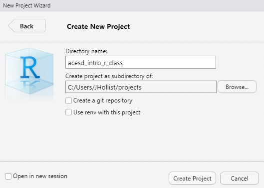
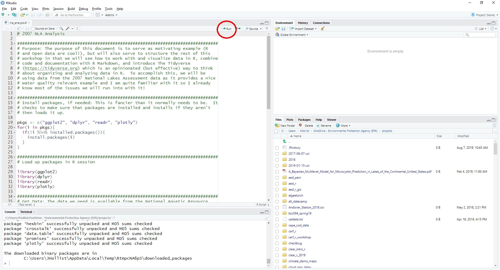

# The Punch Line First

For this first class we are starting at the end and working backwards.  As such this first lesson is going to be in a follow the leader mode.  This is a useful way to teach this as we get to see what is possible early on and then we can focus on the details of how we get there and you will have a working example of an R script that includes a full data analysis.  Let's get started:

## Create a new project in RStudio

We will use the RStudio "File:New Project" dialog to create a new project to house our work for this class.  In RStudio you need to find the New Project menu.

Then select "New Diectory"

Then select "New Project"

The select "Create Project."  Name this project "acesd_intro_r_class". At this point you should now have a new, empty project.  We need to download the R Script and some data that we will be using for our workshop. Let's first create a folder for our R scripts and a folder for our data.  

Now download the files into their appropriate folders.  Right click on each of the the links below and select "Save Link As".  In the window that opens up, browse to the location of the project and the "R" or "data" folders and save these files to the project folder.  Chrome seems to want to call the data file, a ".txt" file.  It shouldn't do that, but it does.  Make sure that you change the ".txt" to ".csv" when you save the file. 

- [ACESD R Analysis](https://raw.githubusercontent.com/jhollist/acesd_intro_r/master/lessons/acesd_analysis.R)
- [2017 National Lakes Assessment Water Chemistry Data](https://www.epa.gov/sites/default/files/2021-04/nla_2017_water_chemistry_chla-data.csv)

## Run the script 

And now we can run the script by selecting all lines (i.e. `ctrl-a`) and then clicking on the `Run` button

